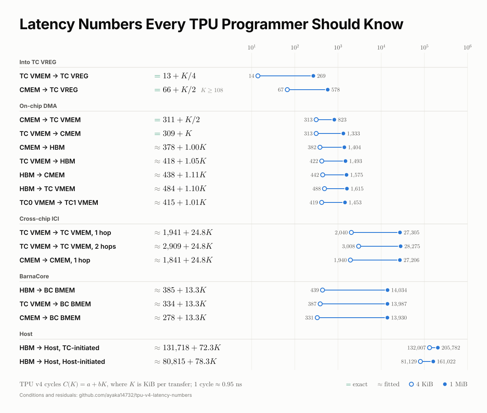

# 测定 TPU v4 各组件的延迟与吞吐

[](latency_numbers.svg)

上图是可单独传播的一图总览：每条路径只取最常用的条件（单 TC、单条 DMA、固定地址），给出周期公式以及 4 KiB 与 1 MiB 时的周期。它由 [`scripts/14_summary.py`](scripts/14_summary.py) 直接读取 [`results/`](results/) 的冻结公式生成；其余条件、窗口、拓扑和残差见下文与[周期线图](VISUALIZATION.md)。

本仓库用 [tpuasm](https://github.com/ayaka14732/tpuasm) 直接在 TPU v4 的机器程序中插入探针，测量数据在各组件之间搬运所需的周期数。测量完整保留[旧版内存与芯片间传输实验](https://github.com/ayaka14732/pallas-tpu-readings-dev/tree/main/tpu_v4_memory_bandwidth)的范围，结果写成 **LCC 周期数随 payload 大小、指令数和并发窗口变化的公式**。不再通过 host 计时对循环次数作线性拟合，也不把旧 GB/s 乘以预设频率当成新测量。所有 TC 实验共用第 0 节的方法；每节回答一条数据路径的问题。

## 仓库与依赖

本项目已从 `pallas-tpu-readings-dev` 独立出来，运行时不读取原仓库。默认工作区把本仓库、[`tpuasm`](https://github.com/ayaka14732/tpuasm) 和 [`tpu-v4-barnacore-support`](https://github.com/ayaka14732/tpu-v4-barnacore-support) 放在同一父目录，并使用 `/srv/workspace/venv` 中的 TPU 版 JAX；需要旧 BarnaCore runtime 的实验另外使用 `/tmp/libtpu-0.0.46`。本仓库按 [MPL-2.0](LICENSE) 开源，内置的 Chart.js 保留其 [MIT 许可证](vendor/Chart.js.LICENSE.md)。

| 路径 | 已验证的 raw 周期公式 | 条件 | 章节 |
| --- | --- | --- | --- |
| TC VMEM → TC VREG | **`C(N) = N + 13`** | `N` 条普通 `vld.8x128` 后经 fence 读取；有效 load-use 间隔 1 cycle，稳态 4 KiB/cycle | [1](#1-tc-vmem--tc-vregvld) |
| Megacore Shared CMEM → TC VREG → 累加 | **`C(N) = 56N + 11`** | 串行 `cld → vpop → vadd`，单 TC | [3](#3-megacore-shared-cmem--tc-vregcld--crf--vpop) |
| 同上，预取深度 `D` | **`C(N,D) = 54⌈N/D⌉ + 2((N−1) mod D) + 13`** | `D=1,2,4`，先发 D 条，随后 pop 与下一条 cld 同 bundle | [3](#3-megacore-shared-cmem--tc-vregcld--crf--vpop) |
| Megacore Shared CMEM → TC VMEM | **`C(S,1) = 311 + S/2048 + ε`** | 单 TC，已测 S≥4 KiB；独立尺寸样本 `ε∈[0,1]` | [2](#2-本地-dma六条有向路径) |
| TC VMEM → Megacore Shared CMEM | **`C(S,1) = 309 + S/1024`** | 单 TC，已测 S≥4 KiB；发现和验证样本逐点相等 | [2](#2-本地-dma六条有向路径) |
| 六条本地有向 DMA 的并发／HBM 条件 | 完整[周期中心公式与验证残差](results/02_local.md) | 单／双 TC，`W=1,4,8`；HBM 仿射项仅为经验中心，双 TC HBM↔Megacore Shared CMEM 还不能收窄为精确预测 | [2](#2-本地-dma六条有向路径) |
| 跨芯片 TC VMEM → TC VMEM，加返回 credit | 首组 `C₀→₁(S,1) = 1941.087 + 24.76987(S/1024) + ε` | 发现范围 4 KiB–4 MiB；独立尺寸全样本 `ε∈[−43.63,47.75]`；全部 69 组、90 条发起端模型见[分表](results/04_remote.md) | [4](#4-tc-vmem-与-megacore-shared-cmem-远程-dma) |
| 跨芯片 Megacore Shared CMEM → Megacore Shared CMEM，加返回 credit | 首组 `C₀→₁(S,1) = 1840.727 + 24.77100(S/1024) + ε` | 首组固定 4 MiB 槽，独立尺寸 `ε∈[−53.41,69.10]`；全部 42 组、48 条发起端模型见[分表](results/04_cmem.md) | [4.4](#44-megacore-shared-cmem-的远端目标不能沿用-tc-override) |
| HBM → BC 私有 BMEM | `C(S,1) = 385.294 + 13.32891(S/1024) + ε` | BC 自己的 paired LCC；W=1/4/16 模型及残差分列 | [5](#5-hbm--bc-私有-bmem) |
| HBM → pinned Host，TC 发起 | `C(S,1) = 131717.990 + 72.32822(S/1024) + ε` | W=1 最大相对误差 2.69%；W=4/16 的独立分段模型见正文 | [6](#6-hbm--pinned-hosttc-发起) |
| TC VMEM／Megacore Shared CMEM → BC 私有 BMEM | W=1 分别为 `333.875+13.33360K+ε`／`278.135+13.33160K+ε` | `K=S/1024`；两种来源 W=1/4/16 均已独立验证 | [7](#7-tc-vmemmegacore-shared-cmem--bc-私有-bmem) |
| 跨芯片完整 payload RTT | 首组 `C₀→₁→₀=2639.399+49.54407K+ε` | 全部 13 个拓扑、16 个发起端模型见[分表](results/08_rtt.md) | [8](#8-返回完整-payload-的-tc-vmem-ping-pong) |
| HBM → 预映射 Host buffer，Host Magic Queue 发起 | W=1：`80815.493+78.32711K+ε`；大窗口见[分段表](results/09_magic_refine.md) | 同一 BC LCC 包围完整 Host 协议，包含端点握手 | [9](#9-hbm--预映射-host-bufferhost-magic-queue-发起) |
| 64 MiB 环形工作集的四条本地 HBM 路径 | 单 TC／W=1 的 Megacore Shared CMEM→HBM：`378.335+1.00119K+ε` | 单／双 TC、W=1/4/8 的 36 组模型及验证残差见[完整表](results/10_hbm_ring.md) | [10](#10-四条本地-hbm-路径的-64-mib-环形工作集) |
| U=A=4 的循环加载与 float32 累加 | TC VMEM：`13N+13`；Megacore Shared CMEM：`62N+12+P` | 单／双 TC，64 KiB–4 MiB 工作集；N 是循环次数，P=BEGIN mod 2；其他 U/A 的统一公式见正文 | [11](#11-保留工作集与累加器条件的循环读取) |
| BC 本地周期 → TC 周期 | **`C_TC = C_BC`** | 16 个 BC 与同芯片 TC0 的 LCC/GTC 比例逐芯片相差不超过 0.05 ppm；第 5、7、9 节的 BC 周期可直接按 TC 周期读 | [12](#12-bc-本地周期与-tc-周期) |

TC 测量共用的发射模型参数（第 0 节）：VIF 容量 20 个 bundle；一项在向量发射后 10 cycles 才在标量侧释放；因此 VIF 为空时一条 `sfence` 使下一 bundle 晚 11 cycles 标量发射；访问 TC VMEM 的 `vld`/`vst` 所在 bundle 最早在标量发射后 2 cycles 向量发射，其他为 1 cycle。BC 使用第 5 节单独校准的本地计数器，不能套用这组 TC 发射参数；但 BC 与同芯片 TC 的 LCC 以相同速率计数（第 12 节），两者的周期数可以直接比较。

### 测量范围与覆盖结果

下表逐项列出旧版范围的覆盖结果，全部条目均已完成周期采样和独立验证。DMA 中 `S` 为每条成功搬运的字节数，`W` 为先发起再统一等待的 DMA 数，一批单流的 payload 为 `W × S`，批次合计 payload 再乘以参与流数。寄存器流的 `N` 在第 1、3 节表示 4 KiB 向量数，在第 11 节表示每轮读取 U 个向量的循环次数。单／双 TC 的各流周期分别记录，不相加不同核心的周期读数。

尺寸粒度也属于公式的条件：第 2、5 节的 DMA 脚本接受 512 B 整倍数，第 4、6–10 节接受 4 KiB 整倍数；每节进一步限定实际采样的大小、窗口、工作集和槽间距。寄存器探针每个向量为 4 KiB。连续形式的中心模型仍以这些已测布局为依据。

| 路径／实验 | 已测条件 | 周期公式的对象 | 结果 |
| --- | --- | --- | --- |
| TC VMEM → TC VREG | 单／双 TC；64/256/1024/4096 KiB 工作集；U=1/4/8/16/32；另保留 1 MiB、U=16/32/64/128、A=8 的展开对照；普通读取和累加分开 | `C(N)`；load-use 与发射吞吐分开 | 普通读取见第 1 节；循环累加的全部工作集、单／双 TC 及 A=8 对照均按第 11 节完成 |
| Megacore Shared CMEM → TC VREG | `cld → CRF → vpop`；同样保留基础工作集及 A=8 展开对照，另含 1 MiB、U=16/32/64/128、A=2 | `C(N)`、push/pop 距离与流水深度 | 第 3 节给出整数流公式；旧版 float32 循环累加、工作集、双 TC 和 A=2 对照全部完成，第 11 节 |
| HBM → TC VMEM、TC VMEM → HBM | 两个方向独立，单／双 TC；W=1 至 4 MiB，W=4/8 至 256 KiB | `C(S,W,TC数)` | 固定地址与 64 MiB 环形工作集的完整矩阵均完成；见第 2、10 节 |
| HBM → Megacore Shared CMEM、Megacore Shared CMEM → HBM | 两个方向独立，同上 | `C(S,W,TC数)` | 两种地址条件的完整矩阵均完成；保留双 TC 的状态波动及预测反例，第 2、10 节 |
| Megacore Shared CMEM → TC VMEM、TC VMEM → Megacore Shared CMEM | 两个方向独立，同上 | `C(S,W,TC数)` | 完成采样和独立尺寸验证，见第 2 节 |
| 同芯片 TC VMEM → 另一 TC VMEM | 四颗芯片，单向及双向同时传输；窗口与大 payload | 发起端本地 `C(S,W)`，包括 completion／credit | 四颗芯片的单向及双向 W=1/4/8 全部完成，第 4 节 |
| 跨芯片 TC VMEM → TC VMEM、Megacore Shared CMEM → Megacore Shared CMEM | 本机四芯片全部 12 个有向对；独立双流、全双工；TC VMEM 另有同一芯片对双 TC 流 | 按拓扑和每流分列 `C(S,W)` | TC VMEM 的 69 组、Megacore Shared CMEM 的 42 组全部完成，第 4 节 |
| TC VMEM ping-pong | 片内及跨芯片；接收端返回完整 payload；保留六个芯片 pair、三种独立双 pair 和四个片内 pair | 同一发起 TC 上的 `C_RTT(S)` | 13 个拓扑全部完成，16 组发起端公式通过独立尺寸检验，第 8 节 |
| HBM → BC 私有 BMEM | 原生 BC descriptor、done、fence；大小与窗口矩阵 | BC 本地完成周期 `C(S,W)` | 完成本地计数器校准、W=1/4/16 大小矩阵及独立验证，第 5 节 |
| TC VMEM → BC 私有 BMEM、Megacore Shared CMEM → BC 私有 BMEM | BC 发起，同芯片；两个方向来源分别列出，保留源释放协议 | BC 本地完成周期 `C(S,W)` | 两种来源的 W=1/4/16 大小矩阵与独立验证完成，保留源释放协议，第 7 节 |
| HBM → pinned Host，TC 发起 | `vint`、Host 处理和 completion semaphore；4 KiB 至 4 MiB，`W=1,4,16` | 同一 TC 请求至确认完成的 `C(S,W)` | 完成全尺寸矩阵、计数器校准和独立验证；W=4/16 分段模型通过新一轮尺寸验证，第 6 节 |
| HBM → 预映射 Host buffer，Host Magic Queue 发起 | 原大小与窗口矩阵，包括 `W=64`；保留 Host 发起协议 | 同一 BC 的 `C(S,W)`，包含 Host/BC 端点握手 | W=1/4/16/64 的周期矩阵与空窗口完成；W=4/16/64 的分段模型通过新增独立尺寸检验，第 9 节 |

每个公式都要附上实际机器片段、起止端点、尺寸／对齐／工作集／窗口条件、重复采样和完整 payload 核验。寄存器流若逐点确定，可以给出精确整数公式；DMA 若存在刷新、仲裁或地址相关波动，则给出周期域中的分段中心模型和残差／分位数，不把最小值或中位数称为精确硬件常数。模型选取与验证使用不同尺寸或独立运行，保留反例；不能只用两点画直线。旧版的无补丁、spill、指令数和 profiler 对照按新实现的实际需要迁移，它们的验证目的仍需覆盖。

正文和分表的小数系数按显示位数取舍，误差与残差按仓库外冻结模型的完整系数计算；整数公式不作近似。因而复算小数模型的最后几位残差时，应读取复现脚本生成的冻结模型。

### 产物存放与复核

批量采样 JSON、逐样本数组、进程日志、冻结模型和完整机器清单默认保存在 `/tmp/tpu_latency_numbers/`，不提交到 Git。下文的“本机”产物路径均相对于 `/tmp/tpu_latency_numbers/evidence/`；这些文件属于当前测量会话，新 checkout 需要先运行对应采样脚本。仓库仅保留复现与分析代码、正文以及 [`results/`](results/) 中精简的公式和残差表。`--output`、`--archive`、`--evidence` 可指定仓库外的数据目录；`/tmp` 不承诺跨机器或重启持久保存。

[周期线图与公式表](VISUALIZATION.md)以数据量为横轴、周期数为纵轴，覆盖本地固定地址／HBM 环形 DMA、片内与跨芯片传输、BC 私有 BMEM、Host、完整 payload 往返、指令流和循环读取；各图可筛选全部已测拓扑、窗口及工作集条件，公式直接列在图下。运行 `scripts/13_visualize.py` 可生成 `/tmp/tpu_latency_numbers/visualization/index.html`；页面只读取已有采样，不重新测量或拟合，完整覆盖范围仍以本文和分表为准。

## 0. 测量方法与发射模型

### 0.1 载体与端点

**载体与插入。** 先用 Pallas 编译一个普通 kernel 作为载体：输入 DMA 把数据放入 TC VMEM，一条带唯一立即数的 `vxor` 标记探针位置，输出 DMA 把结果写回 HBM。脚本用 tpuasm 反汇编载体、找到这条 `vxor`，再用 `insert_executable_bundles` 在此处插入手写汇编片段。插入后的程序不经过编译器重新排程，bundle 的顺序和内容就是设备实际执行的内容；整个过程不修改 libtpu。

**端点。** 每个计时端点独占一个 bundle，在 S0/S1 两个标量槽中同时读取本地周期计数器（LCC）的低、高 32 位：

```text
{ s0: srdreg.lcclo s20 ; s1: srdreg.lcchi s25 }
```

这与 libtpu 自身生成的读周期指令、以及既有的 paired LCC 探针一致（见[第 53 篇](https://github.com/ayaka14732/pallas-tpu-readings-dev/blob/main/research_reports/53_v4_gtc_fixed_timebase.md)），同一 bundle 的两半组成一致的 64 位快照。第 1 节使用三个端点 `R0/R1/R2`；六个 half 在计时结束后经 TC VREG 存到 TC VMEM，随输出 DMA 返回，由 host 拼成 64 位后相减。只需 BEGIN／END 的 DMA 实验及其计数保存方式在各节单独说明。本文 1.3 节的区间只有数百周期，曾用只读低 32 位、按模 `2**32` 相减的版本跑过其中 128 种配置，所得差值与 paired 版本逐一相同；paired 读取的意义在于不依赖区间长度假设，并给出完整的计数器值。

**raw gap。** 下文所有数字都是两个读数的直接差，不预先扣除任何常数。相邻两个读数的 raw gap 为 1，因此若两读数之间有 N 个每周期推进一次的 bundle，raw gap 为 `N + 1`。

**重复与数值核对。** 第 1 节每种配置在同一个修改后的程序上运行 24 次，全部 24 次读数相同；设备返回的每个 word 都与预期逐一比较，包括故意读到旧值的反例。DMA 实验另行报告重复数和分布，不能把这项确定性推广到异步搬运。

**DMA 的完成边界。** 按[第 42 篇](https://github.com/ayaka14732/pallas-tpu-readings-dev/blob/main/research_reports/42_scalar_cycle_boundaries.md)和[第 47 篇](https://github.com/ayaka14732/pallas-tpu-readings-dev/blob/main/research_reports/47_vtrace_vif_timing.md)，标量 LCC 可以越过尚未满足的向量 wait。完成计时必须是 `BEGIN → DMA → 对应 completion wait + sfence → 下一 bundle 的 END`；`sfence` 只排空发射队列，不能替代 DMA wait，也不能与 END 同 bundle。初始化和记录回写放在区间之外，同时保留缺少末端 fence 的负对照。paired low/high 的依据以[第 50 篇的真实回卷验证](https://github.com/ayaka14732/pallas-tpu-readings-dev/blob/main/research_reports/50_scalar_dma_address_variability.md#先把-lcc-读数的语义固定下来)为准，不采用较早笔记中的软件 high/low 重试。

**计数域。** LCC 差值必须来自同一个核心。远程路径先用发起端完成确认或 RTT 定义成本，不相减两个 TC 的 LCC。Host 和 BC 路径分别建立可验证的设备端点。GTC 可辅助检查时基，但[第 53 篇](https://github.com/ayaka14732/pallas-tpu-readings-dev/blob/main/research_reports/53_v4_gtc_fixed_timebase.md)观察到短间隔 raw GTC 的重复和不均匀增量，不能把 raw GTC tick 当成本地执行周期。HBM 的刷新、地址和前序请求状态会改变服务时间，具体限制见[第 50 篇](https://github.com/ayaka14732/pallas-tpu-readings-dev/blob/main/research_reports/50_scalar_dma_address_variability.md)。

### 0.2 发射模型

本文使用既有研究确立的 TensorCore 发射模型（依据 libtpu 内的计数器说明与真机实验，见[第 42 篇](https://github.com/ayaka14732/pallas-tpu-readings-dev/blob/main/research_reports/42_scalar_cycle_boundaries.md)、[第 47 篇](https://github.com/ayaka14732/pallas-tpu-readings-dev/blob/main/research_reports/47_vtrace_vif_timing.md)和[第 53 篇](https://github.com/ayaka14732/pallas-tpu-readings-dev/blob/main/research_reports/53_v4_gtc_fixed_timebase.md)），并用本仓库的实验定出其中的参数：

```text
scalar issue（按序，每 cycle 一个 bundle）──→ 标量指令执行，包括 srdreg 读 LCC
      │
      └─ 含向量/DMA 指令的 bundle ──→ VIF（20 项）──→ vector issue（按序，每 cycle 一个）
            ↑                                              │
            └──────── 向量发射 10 cycles 后，标量侧释放该项 ──┘
```

1. **标量发射。** bundle 按序标量发射，无阻塞时每 cycle 一个。标量指令在标量发射时执行，所以 LCC 读数记录的是该 bundle 的标量发射时刻。
2. **进入 VIF。** 含向量或 DMA 指令的 bundle 在标量发射后进入 VIF（Vector Instruction FIFO）；只含标量指令的 bundle（包括空 bundle 和计时端点）不进 VIF。
3. **向量发射。** VIF 中的 bundle 按序向量发射，每 cycle 最多一个。一个 bundle 最早在标量发射后 1 cycle 向量发射；含访问 TC VMEM 的 `vld`/`vst` 的 bundle 最早在 2 cycles 后（1.3.3）。向量发射还要等源操作数就绪（`vld` 的结果在下一 cycle 可用，`vmul.8x128.f32` 在 2 cycles 后，见 1.3.1）；`vdelay k` 发射后占住向量发射 `k` cycles。
4. **容量与释放。** 一项在向量发射后 **10 cycles** 才在标量侧释放。标量侧有 **20 项**未释放时，任何 bundle 都不能标量发射，包括不进 VIF 的 bundle（0.3）。
5. **`sfence`**（下文记作 `F`）。`F` 所在 bundle 在向量侧按序占一个发射位置；下一 bundle 的标量发射要等 VIF 中所有项，包括 `F` 所在 bundle 自身，都在标量侧释放。VIF 为空时，这正好是 `1 + 10 = 11` cycles，所以每条 `F` 使 raw gap 增加 11（连续 0、1、2、4 条的 raw gap 为 1、12、23、45）。每个探针都在 `R0` 之前放一条 `F`，使计时从 VIF 为空开始。

由此得到三条读数规则。记向量侧落后标量侧 `L` cycles：

- 不经 `F` 的读数只反映标量进度，看不到 `L`，除非 VIF 已满、反压到标量侧。
- `F` 之后的读数比 VIF 为空时晚 `L` cycles，因此包含向量侧的全部等待。
- 进 VIF 的 bundle（包括 `vnop`、`vdelay 0`）使 `L` 不变；不进 VIF 的 bundle 让向量侧追回 1 cycle，`L` 减 1，最少为 0。互锁暂停、`vdelay` 和 `vld`/`vst` 的额外 1 cycle 使 `L` 增加。

### 0.3 VIF 容量与释放延迟

用 `misc: vdelay s23` 占住向量发射 `H` cycles，在其后排 M 个 bundle，再读 `R1`：

```text
R0 → { vdelay s23 } → M × { 填充 } → R1 → F → R2
```

| 填充 | M | `H = 1000` 时 `R1−R0` | `H = 200` 时 `R1−R0` |
| --- | ---: | ---: | ---: |
| `vnop` | 0–19 | `M + 2` | `M + 2` |
| `vnop` | 20 | 1013 | 213 |
| `vnop` | 21 | 1014 | 214 |
| 空 bundle | 20、24 | 22、26 | — |
| `{ va0: vimm ; va1: vimm }` | 19 / 20 / 21 | 21 / 1013 / 1014 | — |
| `vld` | 19 / 20 / 21 | 21 / 1013 / 1014 | — |

- **容量是 20 个 bundle。** 排到第 20 个时，紧随其后的 `R1` 被阻塞。空 bundle 不占位置；一个 bundle 含两条向量指令也只占一个位置；`vld` 与 `vnop` 相同。
- **纯标量 bundle 也被阻塞。** `R1` 本身不进 VIF，仍在第 20 项时停下，与计数器说明“VIF 满时暂停标量发射，无论该 bundle 是否进入 VIF”一致。把 `R1` 与一条 `vnop` 放在同一 bundle，阈值不变（M = 19 时为 21，M = 20 时为 1013）。
- **释放延迟是 10 cycles。** 第一个 `vnop` 在 `H + 3` 时向量发射（`vdelay` 在 2 时发射，占住 `H` cycles），`R1` 却在 `H + 13` 才发射；`H = 200` 与 `1000` 的差值相同。

这也解释了 `F` 的 11 cycles：`F` 所在 bundle 在下一 cycle 向量发射，再过 10 cycles 在标量侧释放。下表的 `{F ; X}` 与 `X → F` 两列都按这条规则算出（完整数据见 1.3.3）：

| X | `{ F ; X }` | `X → F` |
| --- | ---: | ---: |
| 无 | 12 | — |
| `vimm`、`vadd`、`vmov`、`vnop`、`vsyncadd` | 12 | 13 |
| `vdelay 1` | 12 | 14 |
| `vld`、`vst` | 13 | 14 |

与 `F` 同 bundle 的普通向量指令和 `F` 一起在下一 cycle 向量发射，所以与单独的 `F` 相同；`vdelay 1` 的占用发生在自身发射之后，只推迟后面的 bundle；`vld`/`vst` 让整个 bundle 晚 1 cycle 向量发射，所以即使与 `F` 同 bundle 也多 1。

编译器用同一个数。`PufferfishTarget::SfenceMinimumLatency()` 返回 `+0xa4c` 字段（构造函数设为 5），`+0xa50` 为假时再加 5。`Target::Init` 在 `0x19c46299` 以 `sete` 写 `+0xa50`，条件是 `TpuTopology` 首字段等于 2；该字段是构造函数的第一个参数 `TpuPlatformType`。`TpuPlatformTypeToString` 的长度表与字符串 `hardware`、`grm`、`iss` 按 0、1、2 排列，`TpuPlatformTypeToProto` 为 `x + 1`，与 proto 的 `INVALID/HARDWARE/GRM/ISS = 0/1/2/3` 对应。因此 `+0xa50` 表示“目标是 ISS 指令集模拟器”：模拟器上编译器按 5 排程，真机上按 `5 + 5 = 10`，与本节测得的释放延迟相同。

### 0.4 模型验证

[`01_vld_model.py`](scripts/01_vld_model.py) 把 0.2 的五条规则写成逐 bundle 重放器，参数只有：VIF 20 项、释放延迟 10、访问 TC VMEM 的 `vld`/`vst` 最早 2 cycles 后向量发射、`vmul` 结果 2 cycles 后可用、`vdelay` 的占用。重放本文全部 297 个探针片段，每个配置的 `R1−R0`、`R2−R0` 都与真机相同，包括 VIF 被填满、反压到 `R1` 的长序列。改动任一参数都会出现不一致：容量取 19 或 21 时分别只有 270、276 个配置吻合，释放延迟取 9 或 11 时只有 6 个，去掉 `vld`/`vst` 的额外 1 cycle 时有 247 个，把额外 1 cycle 改成按槽计算（`vld`/`vst`/`cld` 槽中的所有指令都算）时有 291 个。

## 1. TC VMEM → TC VREG（`vld`）

### 1.1 TC VREG 的数量

每个 TensorCore 有 **32 个** TC VREG（`v0`–`v31`），每个为 `8 × 128 × 4 B = 4 KiB`，共 128 KiB。

这个数来自 libtpu 内嵌的 TPU v4（代号 Pufferfish）芯片描述 `pufferfish_chip_parts.binarypb`。它不是 wheel 中的独立文件，需要从资源名的 ELF 重定位找到 `FileWrapper` 描述符，取出数据地址和长度（描述符中的 MD5 可校验提取结果），再按 protobuf 解码 `TpuChipPartsProto → TpuCorePartsProto → TpuSequencerPartsProto` 的寄存器表：TensorCore sequencer 的 SREG、TC VREG、PREG、VMREG 数量依次为 32、32、15、8。反汇编可确认编译器确实消费了这个字段：`Target::Init` 调用 `TpuSequencerParts::RegisterCount` 取出 TC VREG 数量，`Target::VregCount()` 返回它。具体地址随 libtpu 版本变化，不在此记录。

tpuasm 的编码器给出独立的交叉验证：TC VREG 操作数字段宽 5 bit，`vld.8x128 v31, [vmem:0x0]` 可以汇编，`v32` 则报 `value 32 exceeds 5-bit field`。

32 是物理寄存器数。一个 kernel 能同时保留多少个用户值，还受 live range 和编译器临时值影响。

### 1.2 旧版 Pallas 实验（已被 1.3 取代）

最早的实验在 Pallas kernel 中通过一个锁定旧版 libtpu 的编译器扩展插入 LCC 读数、`sfence` 和排程屏障，测量连续 32 条 `vld`。两端各加一条 `sfence` 时，区间扣除端点后为 44 cycles；空区间中一条 `sfence` 贡献 11，扣除后剩 `44 − 11 − 32 = 1`。1–4 条 load 同样各多 1。这个多余的周期容易被解读成“`vld` 有 2 cycles 延迟”，但该实验没有读取 load 结果的 consumer，无法区分数据延迟和发射尾部。

1.3 节用 tpuasm 复现了这些数字（32 条 load 加末端 fence 的 raw gap 为 45，即旧版的 44 加端点的 1），并用 consumer 与依赖/独立对照回答了这个问题。旧的编译器扩展已删除：tpuasm 直接写 `srdreg.lcclo`/`srdreg.lcchi` 和 `sfence`，也不再需要排程屏障。

### 1.3 tpuasm 实验

#### 1.3.1 load-use 间隔为 1 cycle

结论分两步得出：先看 consumer 在哪个距离读到新值，再看读到新值的代价，即硬件是否用互锁（计分板，scoreboard）暂停了 consumer。只有第一步不够，因为带互锁的流水线在相邻 bundle 也能读到正确值，只是要等。

**数值：`d = 1` 读到新值。** 计时前把 `v11` 全部设为 `0xdeadbeef`，TC VMEM 中是随机 uint32。让 consumer 读 `v11`，改变它与 load 的 bundle 距离 `d`：

```text
# d = 0：同 bundle，consumer 读到旧值
{ vld: vld.8x128 v11, [vmem:0x0] ; va0: vadd.8x128.s32 v10, 1, v11 }

# d = 1：相邻 bundle，consumer 读到新值
{ vld: vld.8x128 v11, [vmem:0x0] }
{ va0: vadd.8x128.s32 v10, 1, v11 }
```

| consumer | `d = 0` | `d = 1, 2, 4` |
| --- | --- | --- |
| `va0: vadd.8x128.s32` | 旧值 + 1 | 输入 + 1 |
| `va1: vadd.8x128.s32` | 旧值 + 1 | 输入 + 1 |
| `va0: vmov.8x128` | 旧值 | 输入 |
| `vst: vst.8x128` | 存入旧值 | 存入输入 |

每个结果都对全部 1024 个 word 成立。但把 producer 换成 `vmul.8x128.f32`（`v9` 设为 1.5f）后，consumer 同样在 `d = 0` 读到旧值、在 `d = 1, 2` 读到 2.25f，而下面会看到 `vmul` 的结果并不能在 1 cycle 后使用。所以这张表只说明硬件在 `d = 1` 时保证了数据正确，不说明间隔是 1 cycle。

**时间：依赖不引入等待。** 比较 N 组连续的 producer → consumer 对。依赖版的 consumer 读刚写入的 `v11`，独立版读计时前准备好的 `v9`，其余完全相同：

```text
R0 → N × { producer → v11 } { vadd v10, 1, <v11 或 v9> } → R1 → F → R2
```

| producer | N | 独立版 `R1−R0` / `R2−R0` | 依赖版 `R1−R0` / `R2−R0` |
| --- | ---: | ---: | ---: |
| `vld.8x128` | 16 | 33 / 45 | 33 / 45 |
| `vld.8x128` | 64 | 129 / 141 | 129 / 141 |
| `vld.8x128` | 128 | 257 / 269 | 257 / 269 |
| `vmul.8x128.f32` | 16 | 33 / 45 | **33** / 60 |
| `vmul.8x128.f32` | 64 | 129 / 141 | 174 / 204 |
| `vmul.8x128.f32` | 128 | 257 / 269 | 366 / 396 |

`vmul` 是正控制。依赖版的每个 consumer 在向量发射时被互锁暂停 1 cycle，`L` 每对加 1，到 `R1` 时为 N；`R1` 不进 VIF，追回 1，所以 `R2−R0` 比独立版多 `N − 1`，为 `3N + 12`。也就是说，`vmul.8x128.f32` 的结果在发射 2 cycles 后才可用，consumer 放在 `d = 1` 时数值正确，代价是暂停 1 cycle。同理，单对 producer → consumer 的暂停只让 `L` 变为 1，又被 `R1` 追回，所以前面的距离实验中 `vmul` 与 `vld` 的读数相同，必须用长序列才能看出差别。

这组数据也说明为什么只能用 `R2`：N = 16 时依赖版 `vmul` 的 `R1−R0` 仍为 33，因为标量侧不等向量侧；N = 64、128 时积压填满 VIF、反压标量发射，`R1` 才变大；按 0.2 的容量与释放延迟，重放器逐一算出了 174 和 366。

`vld` 的依赖版和独立版在 `R2−R0` 上逐一相同（`2N + 13`），即依赖没有让 `L` 增加。如果 load 结果要 2 cycles 才可用，依赖版会像 `vmul` 一样多出 `N − 1`，N = 128 时为 127 cycles。因此普通 `vld.8x128` 的**有效 load-use 间隔为 1 cycle**：下一个 bundle 的 consumer 不但读到新值，而且不被暂停。这是调度层面可见的间隔，可能包含 forwarding，不代表 TC VMEM 读出或 TC VREG 写回的内部级数。

#### 1.3.2 稳态吞吐为每 cycle 一条

连续发出 N 条 load，目的寄存器在 `v0`–`v7` 间轮换，地址在 32 个 tile 间轮换：

| N | `R1−R0` | `R2−R0` |
| ---: | ---: | ---: |
| 16 | 17 | 29 |
| 64 | 65 | 77 |
| 128 | 129 | 141 |

N 从 64 增至 128 时，`F` 之后的 `R2−R0` 也只增加 64，说明向量侧同样每 cycle 发射一条，`L` 没有随 N 增长。每条 4 KiB，即单个 TensorCore 在该访问模式下 **4 KiB/cycle**。

适用范围：普通、对齐、全 sublane 的 `vld.8x128`。1.3.3 中带 `ss=2`、`sm=0xf` 的 load 和 `vld.sshfl` 连续 64 条（固定地址）也是每 cycle 一条；未覆盖 indexed addressing、bank conflict 和并发 DMA 争用。

#### 1.3.3 末端 fence 为什么多 1 cycle

1.2 节的多余周期来自末端 `F`，与数据是否就绪无关：

| 区间 | raw gap |
| --- | ---: |
| `R0 → F → R1` | 12 |
| `R0 → N × vld → R1` | `N + 1` |
| `R0 → N × vld → F → R1` | `N + 13` |

空区间中插入 `F` 增加 11，紧跟 load 流插入则增加 12；统一扣除 11 就会剩下 1。按 0.2 的规则，这 1 cycle 是含访问 TC VMEM 的 `vld`/`vst` 的 bundle 最早在标量发射后 2 cycles 才向量发射，而其他向量 bundle 是 1 cycle：`F` 所在 bundle 排在 load 后面，于是晚 1 cycle 向量发射，也晚 1 cycle 释放。

下表把一条指令 X 放在 `F` 之前、与 `F` 同 bundle、与 `F` 隔一个空 bundle，以及连续 64 条后接 `R1 → F → R2`：

| X | `X → F` | `{ F ; X }` | `X → {} → F` | 64 × X：`R1−R0` / `R2−R0` |
| --- | ---: | ---: | ---: | ---: |
| `vld.8x128`：立即数地址、`s24+0x8`、`ss=2`、`sm=0xf`；`vld.sshfl`；与 `vimm` 同 bundle | 14 | 13 | 14 | 65 / 77 |
| `vst.8x128`：立即数地址、`s24+0x80`；`vst.msk` | 14 | 13 | 14 | 65 / 77 |
| `vimm`（`va0`、`va1`）、`vadd`（向量或标量操作数）、`vmov`（向量或标量来源）、`vrot.slane`、`vsyncadd`、`vnop` | 13 | 12 | 14 | 65 / 77 |
| `vst` 槽的 `vpush v2sf`；`cld` 槽的 `cld.8x128 crf, [cmem:0x0]`；`vx0` 槽的 `vmatpush`、`vperm`；`va0` 的 `vpush erf` | 13 | 12 | 14 | — |
| `vdelay 1` | 14 | 12 | 14 | 100 / 140 |

推入 FIFO 的指令在计时后弹出，不做连续 64 条的对照；它们后接 `vnop` 再接 `F` 都是 14，与普通指令相同。

- **额外的 1 cycle 属于 TC VMEM 访问，而不是指令槽。** `vld`/`vst` 的所有地址形式、stride、sublane mask、shuffle、store mask 都有；同在 `vst` 槽但不访问 TC VMEM 的 `vpush v2sf` 没有；访问 Megacore Shared CMEM 的 `cld` 也没有；读标量寄存器操作数的 `vadd`、`vmov`，以及 `vsyncadd`、MXU/XLU/EUP 的推入指令都没有。所以它既不来自槽位，也不来自标量操作数读取或地址写法，而是 TC VMEM 读写请求在向量发射前多占的 1 cycle。libtpu 的 Pufferfish 计数器说明列出了 `vmem_read_after_write_wait`、`vmem_store_queue_full`、`vst_reserved` 等暂停向量发射的原因，但它们都是按条件出现的暂停，没有描述这个固定偏移。
- **它是发射偏移，不占吞吐。** 64 条 `vld` 或 `vst` 的 `R2−R0` 与 64 条 `vnop` 相同。连续 load 时，后一条本来就排在前一条后面 1 cycle，最早可发射时刻不再起作用，所以不累加；N 条 load 后接 `F` 是 `N + 13`。
- **只有不进 VIF 的 bundle 能追回它。** `X → {} → F` 全部是 14：中间的空 bundle 给了向量侧 1 cycle，load 的偏移被吸收，普通指令则只是多了一个 bundle。1.3.1、1.3.2 的长序列在 `F` 前有 `R1`，偏移同样被吸收，所以 `R2−R1` 都是 12。换成 `vnop` 则不能吸收：

| 填充 K 个 | K=0 | K=1 | K=2 | K=16 | K=64 |
| --- | ---: | ---: | ---: | ---: | ---: |
| `vld` 后接空 bundle 或 `sadd.s32 s24, 0, s24`，再接 `F` | 14 | 14 | 15 | 29 | 77 |
| `vld` 后接 `vnop` 或 `vdelay 0`，再接 `F` | 14 | 15 | 16 | 30 | 78 |
| `vld` 后接 `vdelay 1`，再接 `F` | 14 | 16 | 18 | 46 | 142 |

这个偏移发生在发射侧，与数据可用时间无关：1.3.1 已经表明 load 的下一个 bundle 能读到新值且不被互锁暂停。

对计时的影响：测量 load 流时，不要用空区间的 `F` 开销去扣除 load 流后面的 `F`，而应与结构相同、只差待测因素的对照相减（如 1.3.1 的依赖版与独立版）。也不要改用无 `F` 的 `R1`：1.3.1 的 `vmul` 表明它会漏掉向量侧的等待。

#### 1.3.4 与编译器模型的对照

libtpu 0.0.49 的 TPU v4 排程模型给出相同的数：`LloInstruction::CreateVectorLoad` 生成的普通 vector load 经 `GetPufferfishInstruction` 映射到性能枚举 `0x131`，`PufferfishPerformance` 构造函数把该项 latency 设为 1，`LatencyTablePufferfish::LatencyBetweenInternal` 在计算依赖边时读取它。这是编译器的模型，不是硬件测量，但与 1.3.1 的真机结果一致。

`sfence` 方面，编译器在真机上按 10 cycles 排程，与 0.3 测得的释放延迟相同，推导见 0.3。

### 1.4 复现

在仓库根目录运行（若 venv 中缺少 tpuasm，先 `/srv/workspace/venv/bin/python -m pip install -e ../tpuasm`）：

```sh
./tpu_type.sh
/srv/workspace/venv/bin/python scripts/01_vld.py
```

脚本 [`01_vld.py`](scripts/01_vld.py) 使用本机四芯片、只在第一颗芯片的一个 TensorCore 上运行，不调用分布式初始化。全部 297 种配置约 2 分钟；运行后可用 `/srv/workspace/venv/bin/python scripts/01_vld_model.py` 在 CPU 上用 0.2 的模型重放全部片段。也可用 `--group` 分组运行：`consumers` 和 `streams` 对应 1.3.1（`streams` 同时包含 1.3.2），`fence_tails` 和 `issue_offsets` 对应 1.3.3 和 0.3 的 `F` 表，`vif` 对应 0.3 的容量实验。脚本检查 libtpu 为 `0.0.49`；升级 libtpu 后应重新核对载体的标记位置和结果。

本文数据的环境：Python 3.14.7 free-threading、JAX `0.12.0.dev20260926+886d2370c1`、jaxlib `0.11.2`、libtpu `0.0.49`（Build ID `97e27df7268da25ab03e455e30dd86b0`）、tpuasm `0.1.0`（commit `b4021991`）。

产物写入 `/tmp/tpu_latency_numbers/01_vld/`：`carrier.tpuasm` 是载体的完整反汇编；每种配置的 `<name>.tpuasm` 是插入的片段，`<name>.npy` 是 24 次运行返回的全部数据；少数代表性配置另有 `<name>.full.tpuasm`，是修改后程序的完整清单，并经过汇编往返的逐字节核对；`results.jsonl` 和 `summary.json` 记录全部 LCC 读数、差值和数值核对结果。

## 2. 本地 DMA：六条有向路径

[`02_local_dma.py`](scripts/02_local_dma.py) 使用同一种载体测 HBM、TC VMEM、Megacore Shared CMEM 之间的全部六条有向路径。输入源与目的区分开；目的区每次都先写入 `0xdeadbeef`，HBM 和 Megacore Shared CMEM 的目的区也经过实际 DMA 初始化。计时后回读完整目的 payload，同时检查源和未触及的 padding。这样即使前一次调用已经复制过相同输入，本次没有搬运也不能通过核验。

Megacore Shared CMEM 端点使用 tpuasm 的 `[cmem:sN]`，对应 `core_id=1, memory_id=2`；HBM 为 `(1,0)`。这次补齐了 tpuasm 对该组合的编码和打印，六条路径均经过实际搬运及源码往返验证。载体不使用编译器的 Megacore Shared CMEM allocation，直接为本次独占实验保留地址从零开始的空间；双 TC 按工作集大小划分不重叠的 Megacore Shared CMEM 区域。复现需要使用包含这项更改的同工作区 tpuasm 源码。

### 2.1 三个端点和窗口协议

`W=1` 时的计时片段为：

```text
初始化源与带哨兵的目的区 → wait + sfence
R0
DMA(S)
R1
{ sfence ; vwait.ge 本次 completion, S/512 }
R2
```

`R1−R0=2` 只描述发出侧的标量进度；完成成本是 `C(S)=R2−R0`。`W>1` 时先连续提交 W 条互不重叠的 DMA，每两条之间用一个 bundle 的 S0/S1 同时递增源、目标地址，最后等待合计 `WS/512` 个 granule 的 completion。此时 `R1−R0` 的无反压基线为 `2W`，并非 W 条搬运已经完成。计数器回写、数据回读和 completion 归零都位于 `R2` 之后。

双 TC 的准备阶段还包含同芯片 signal/wait rendezvous，然后才进入各自的 R0。每个 TC 用自己的三个 LCC 读数相减，不把两个 TC 的计数器当作同一时钟。这个握手保证对端已准备好数据，不能声称两个 R0 在物理时间上完全同时。

### 2.2 扫描和验证

[`02_local_suite.py`](scripts/02_local_suite.py) 顺序运行发现组、独立尺寸验证组和没有末端 fence 的负对照。发现组在 `W=1` 下覆盖 512 B 至 4 MiB，并在 1–4 KiB 的粒度变化处增加 1536、2560、3072 B；`W=4,8` 保留旧版的 4、16、64、256 KiB。验证组采用 6、12、24、48 KiB 等非二次幂尺寸和独立 seed；每配置预热两次后采样 24 次。每颗 TC 的分布单独保存。

```sh
/srv/workspace/venv/bin/python scripts/02_local_suite.py
/srv/workspace/venv/bin/python scripts/02_local_model.py archive
```

默认输出为 `/tmp/tpu_latency_numbers/02_local_suite/`。每个子任务保存命令、退出状态、环境、完整载体与插桩汇编、逐样本 paired LCC 和数据核验结果。成功任务可按退出状态跳过；修改探针协议后应指定新的输出目录，避免复用旧状态。脚本自动通过 `PYTHONPATH` 使用相邻 `tpuasm/src`。

本轮完成了 **510 个配置、12,240 次正式调用、18,144 个同 TC 周期间隔**，全部通过完整 payload 和未触及区核验。其中发现组 300 个配置，独立尺寸组 192 个，负对照 18 个。负对照把末端 fence 移到 END 之后，六条路径在 4 KiB、64 KiB、1 MiB 的 `R1−R0` 均为 2，`R2−R0` 均为 4；随后同步并回读仍数值正确。这直接重现“数据最终正确不等于 END 已测到完成”的陷阱。

### 2.3 Megacore Shared CMEM ↔ TC VMEM 的公式

令 `K=S/1024`，以下为单 TC、W 条连续且互不重叠的消息的 raw 完成周期。`S≥4 KiB`，发现组最大 S 为 W=1 时 4 MiB、W=4/8 时 256 KiB；公式不覆盖小于 4 KiB 的粒度特例。

| 路径 | 窗口 | raw 周期公式 | 发现组全样本 ε | 独立尺寸组全样本 ε |
| --- | ---: | --- | --- | --- |
| Megacore Shared CMEM → TC VMEM | 1 | `C=311+K/2+ε` | [0,1] | [0,1] |
| Megacore Shared CMEM → TC VMEM | 4、8 | `C=310+W×max(3,K/2)+ε` | [−1,0] | [0,0] |
| TC VMEM → Megacore Shared CMEM | 1 | `C=309+K+ε` | [0,0] | [0,0] |
| TC VMEM → Megacore Shared CMEM | 4 | `C=310+WK+ε` | [−1,0] | [0,0] |
| TC VMEM → Megacore Shared CMEM | 8 | `C=310+WK+ε` | [0,0] | [0,0] |

这里的 ε 是保存样本相对公式的**观测残差**，不是硬件最坏上界。`max(3,K/2)` 保留了小消息多请求时的附加成本；不能把它删掉只按总字节数计费。W=1 的反向在两组共 504 个样本上精确等于 `309+K`；正向在个别尺寸上多 1 cycle。两条路径的大消息斜率分别为 2048 和 1024 B/cycle，但固定项约三百个周期，不能用稳态吞吐倒推 4 KiB 的完成成本。

[`02_cmem_model.py`](scripts/02_cmem_model.py) 直接写出这些公式，没有对验证组调整参数；发现残差（本机 `02_local/cmem_discovery.json`）与验证残差（本机 `02_local/cmem_validation.json`）可逐样本重算。双 TC 的 Megacore Shared CMEM→TC VMEM 也接近每核 `311+K/2`，TC VMEM→Megacore Shared CMEM 固定项有约 1–2 cycles 变化，各 TC 结果见完整表。

### 2.4 HBM 路径的中心模型与限制

HBM 路径保存完整周期分布，在发现组上建立 `C(S)=a+bK+ε`，随后冻结参数，再采独立尺寸组。这里使用周期域经验模型表达大小关系；没有使用 host 时间，也没有以循环次数拟合并扣除 dispatch。本节使用固定 HBM 地址；旧版的 64 MiB 环形工作集已在第 10 节单独完成测量，两种地址条件的参数分别报告。

单 TC、W=1 的结果如下。误差均在未参加建模的验证组上计算：

| 路径 | 周期中心公式 | 各尺寸中位数最大误差 | 全样本观测残差 |
| --- | --- | ---: | --- |
| HBM → TC VMEM | `C≈483.58+1.10462K` | 55.23 | [−138.97,451.08] |
| TC VMEM → HBM | `C≈417.542+1.05063K` | 8.20 | [−30.08,33.58] |
| HBM → Megacore Shared CMEM | `C≈438.014+1.11045K` | 31.84 | [−264.31,411.17] |
| Megacore Shared CMEM → HBM | `C≈378.315+1.00129K` | 4.32 | [−5.32,106.71] |

完整的 54 组按方向、窗口、TC 数和本地 TC 编号分列的[公式与残差表](results/02_local.md)同时保留失败的点模型。例如双 TC 的 HBM→Megacore Shared CMEM、W=1、TC0 在验证组出现 **1270.07 cycles 的中位数误差**，单条仿射公式没有通过准确预测的要求；反向虽然中位数误差小得多，个别样本残差仍达数千周期。现有数据只证明这种并发条件下的服务状态不能压成一个固定常数和斜率，尚未分离地址、前序准备和共享队列的贡献。不能把“完成了逐点残差计算”写成“54 条公式都精确成立”。

原始 paired LCC、配置、数值通过记录、进程状态及每组代表性完整汇编保存在本机 `02_local/`。发现组模型在对应验证任务启动前冻结，`models.json` 与 `validated_models.json` 分开保存；后者只增加验证残差。以下命令仅在 CPU 上重放，不占用 TPU：

```sh
/srv/workspace/venv/bin/python scripts/02_local_model.py validate --root /tmp/tpu_latency_numbers/evidence/02_local
/srv/workspace/venv/bin/python scripts/02_cmem_model.py --phase validation --root /tmp/tpu_latency_numbers/evidence/02_local
```

## 3. Megacore Shared CMEM → TC VREG（`cld → CRF → vpop`）

### 3.1 每次读取与累加的周期公式

这里 `N` 是读取的 4 KiB 向量数量，总逻辑读取量为 `S=4096N`。源为一个预先经 DMA 填好的 128 KiB Megacore Shared CMEM 工作集，地址循环经过 32 个不同向量。计时前清零一个 uint32 累加器，所有 pop 的 1024 个 word 都进入这个累加器；计时后逐 word 核对模 `2**32` 的完整和。这是读取加整数累加的成本，尚不等于旧版浮点累加、循环寻址或双 TC 的成本。

串行版每个向量占三个 bundle：

```text
R0 → N × { cld crf, CMEM[i] } { vpop v11, crf } { vadd v10, v11, v10 } → R1 → F → R2
C_serial(N) = R2 − R0 = 56N + 11
```

流水版先发 D 条 cld，在剩余读取中把 pop 与下一条 cld 放到同一 bundle；下一个 bundle 累加刚 pop 的结果。最后排空剩余 D 条。`D=1,2,4` 时：

```text
C_pipeline(N,D) = 54 × ceil(N/D) + 2 × ((N−1) mod D) + 13,  N ≥ D
```

公式中的取整不可省略。流水版每组 D 个结果的主成本是 54 cycles，最后一组每多一个结果增加两个 bundle；它不是对 N 作一条平均直线。后续深流水结果见 3.4，D=4 并非这里测到的吞吐上限。

| N | 串行 | D=1 | D=2 | D=4 |
| ---: | ---: | ---: | ---: | ---: |
| 4 | 235 | 229 | 123 | 73 |
| 16 | 907 | 877 | 447 | 235 |
| 64 | 3595 | 3469 | 1743 | 883 |
| 128 | 7179 | 6925 | 3471 | 1747 |
| 7，独立进程 | 403 | 391 | 229 | 125 |
| 31，独立进程 | 1747 | 1687 | 877 | 449 |
| 65，独立进程 | 3651 | 3523 | 1795 | 931 |

表内是完成端点的 raw LCC 差，所有重复均为相同整数。另有 N=1、3 的有效组合，完整记录见首轮（本机 `03_cld/pilot.json`）、D=2/4 轮（本机 `03_cld/pipeline.json`）和非整组复核（本机 `03_cld/holdout.json`）。非整组数据用于检查完整取整公式，后续扩大流水深度时应重新验证，不能外推这几组常数。

### 3.2 等待发生在哪里

先隔离 `cld` 与 `vpop`，在两者之间放 `d−1` 个 `vnop`，让它们相距 d 个 bundle：

```text
R0 → cld → (d−1) × vnop → vpop v10 → R1 → F → R2
C_gap(d) = max(67, d + 14)
```

`d=1,2,4,8,16,32` 时都为 67；d=64、128、256 时分别为 78、142、270。短距离时向量侧等待 CRF，长距离时人工空隙超过等待。无 fence 的 `R1` 并不代表结果已读出，不能用其差值推导 cld 延迟。

另一个实验把 `vadd v10, 1, v11` 放在 pop 的同 bundle 或之后。d=0 时读到先前的 `0xdeadbeef`，d≥1 时读到输入加一，当前构造的完成周期为 `67+d`。这说明同 bundle 不消费新 pop 结果，相邻 bundle 可以得到正确值；它还没有像第 1 节那样用依赖／独立长链对照单独定出 pop 的有效 load-use 间隔。两种探针的 consumer 与准备片段不同，不能混减一个常数后宣称已经测出物理 CRF 内部级数。

### 3.3 复现与逐样本核对

```sh
/srv/workspace/venv/bin/python scripts/03_cld_suite.py
/srv/workspace/venv/bin/python scripts/03_cld_model.py
```

[`03_cld_suite.py`](scripts/03_cld_suite.py)顺序复现浅流水、非整组、深流水和 fused 排程的七组实验，检查每组的 N/D 集合与重复次数，再将记录整理到 `/tmp/tpu_latency_numbers/evidence/03_cld/`。它复用已完成且通过核对的组；`--archive-only` 只整理当前记录，不启动 TPU。浅流水公式推广到 D=27/28 时的反例也由这些记录重新生成。

底层 [`03_cld.py`](scripts/03_cld.py) 复用第 1 节的 paired LCC 载体，准备阶段新增 TC VMEM → Megacore Shared CMEM DMA 并确认完成。产物包括每条插入片段、原始输出数组与读数；独立运行时默认写到 `/tmp/tpu_latency_numbers/03_cld/`。`--group streams --counts 3,7,31,65` 可复核非整组；`--depths` 控制预取深度。

[`03_cld_model.py`](scripts/03_cld_model.py) 默认只读 `/tmp/tpu_latency_numbers/evidence/03_cld/` 的本机记录，无须 TPU，重新检查全部 153 个配置、3348 个样本的 64 位差值、1024-word 数值通过记录和整数公式。首轮每配置采 12 次，其余每配置采 24 次；每轮结束后再次运行未插桩载体核对 baseline。环境与第 1 节相同，Megacore Shared CMEM DMA 使用本次扩展后的 tpuasm。

### 3.4 深流水的预取与排空成本

当前 libtpu 0.0.49 的 `PufferfishTarget::GetCrfFifoDepth()` 返回 32（当前构建地址 `0x19218e78` 的 `mov $0x20,%eax; ret`）。这提供了扩展预取深度的编译器线索，不单独作为硬件 FIFO 容量的测量结论。进一步实测 `D=8,16,24,26,27,28`，最长读取 256 个向量，仍对每个结果累加核验。

简单地把浅流水公式推广为 `67 + max(54,2D)×floor((N−1)/D) + 2((N−1) mod D)` 在 D≤26 的已测点成立，但 D=27、28 分别少算 1、3 cycles。原预测与反例（本机 `03_cld/rejected_deep_model.json`）保留了这个失败，不能在修改公式后把旧预测说成通过。

加上预取与最终排空的固定成本后，完整公式为：

```text
C_split(N,D) = max(67,2D+14)
             + max(54,2D) × floor((N−1)/D)
             + 2 × ((N−1) mod D),  N ≥ D
```

新公式先由深度扫描（本机 `03_cld/deep.json`）得到，再以独立进程的 N=29、55、97 和新增 D=26 检验，18 个配置的 432 个样本（本机 `03_cld/deep_holdout.json`）全部逐周期吻合。此时 D=27 的 `C=2N+66`，D=28 为 `2N+68`，增大深度不再提高这份“每个 pop 后单独一个累加 bundle”的稳态吞吐。

| N | D=8 | D=16 | D=24 | D=27 | D=28 |
| ---: | ---: | ---: | ---: | ---: | ---: |
| 31 | 241 | 149 | 133 | 128 | 130 |
| 64 | 459 | 259 | 205 | 194 | 196 |
| 128 | 891 | 475 | 351 | 322 | 324 |
| 256 | 1755 | 907 | 637 | 578 | 580 |
| 97，独立验证 | 715 | 391 | 283 | 260 | 262 |

这份结果说明浅流水的等待可以通过在途读取隐藏。代表性完整机器清单（本机 `03_cld/stream-n128-d28.full.tpuasm`）保留了 128 次读取、pop、累加和最后排空，供独立审阅。

### 3.5 把 consumer 合到下一次 pop，完成周期仍然相同

进一步用 `--schedule fused` 将上一结果的 `vadd` 放入下一次 `vpop` 的 bundle。同 bundle 的 consumer 读到旧的 `v11`，正好是上一条结果；最后另用一个 bundle 消费最后一个结果。这样 N 次 pop 的主体从 2N 个 bundle 缩为 N+1 个，结果仍逐 word 验证。

35 个发现配置、840 个样本，以及独立进程的 `N=29,55,97`、27 个配置、648 个样本，全部继续满足 3.4 的同一条整数公式。也就是说，在已测 `D≤28` 的序列中，减少显式 consumer bundle **没有减少完成周期**。两周期项不能简单归因于源代码每次迭代写了两行，但本实验仍不能把它唯一归因于 CRF 的某个内部端口；CLD、pop 与 consumer 的组合资源约束也在区间内。

例如 `N=128,D=27` 的 split 和 fused 均为 322 cycles，`D=28` 均为 324。归档包括发现样本（本机 `03_cld/fused.json`）、独立验证（本机 `03_cld/fused_holdout.json`）与合并排程的完整机器清单（本机 `03_cld/fused-n128-d28.full.tpuasm`）。

## 4. TC VMEM 与 Megacore Shared CMEM 远程 DMA

远程成本必须先定义“完成”的含义。本节在发起 TC 上测量 **payload 发起至接收端确认并返回 credit** 的周期区间。它包含一条数据路径及反向的小型控制消息，不能称为纯单向链路延迟，也不能与完整 payload 往返的 RTT 混用。每个流的起止 LCC 均取自同一个 TC。

### 4.1 协议与端点

[04_remote_dma.py](scripts/04_remote_dma.py) 用 Pallas 编译真实的 remote DMA、send/recv completion 和 credit 协议。输入先放入发送 TC VMEM，接收 TC VMEM 每次调用都写入 `0xdeadbeef`；所有参与 TC 完成 ready rendezvous 后才进入测量。探针插在第一条 payload `dma.general` 之前，以及最终 payload 回写 HBM 之前：

```text
准备数据与接收区 → ready rendezvous → sfence
保存四个空闲 SREG → paired BEGIN
连续发起 W 条 payload DMA
等待本地 send completion；接收端等待 recv completion
全部接收端先发送各自的 credit
全部发起端再等待各自的 credit
sfence → 下一 bundle 的 paired END
把四个 counter half 写入 SMEM → 恢复 SREG → 回写记录与完整 payload
```

有四个空闲 SREG 时，探针从实际机器区间中选择它们，原值在 BEGIN 前保存、END 后恢复，区间内不 spill。W=4 的片内双向／同一芯片对双 TC 载体，以及本轮 W=8 载体不足四个空闲 SREG；为覆盖这些配置，探针采用第 6 节相同的两寄存器 SMEM 端点：BEGIN 后写出计数并恢复借用寄存器，END 前保存现场，再读出另一对计数。这些额外指令计入 raw 周期，不能扣掉一个常数后与四寄存器模式混称。每组审计记录 `counter_storage`，端点校准见下方复现命令。

最终独立 SMEM 记录区还保留四个未改动的 guard word。所有返回数据都逐元素核验，包括未接收节点的 poison、每个窗口槽中的有效前缀，以及没有请求传输的尾部。

大小扫描复用固定容量的机器载体。仅修改每条 remote DMA 的 `length`，以及该条的 send/recv wait 和 completion 清零数，共五处；地址、窗口槽间距、指令数和分支不变。`S` 变化时，每槽只传前 S 字节，其余仍应为 poison。`W=1` 的槽容量为 4 MiB，`W=4,8` 为每槽 256 KiB。这个固定间距也是公式的条件，不能把它隐去后套用到任意交错布局。

节点编号为 `chip × TC数 + tc`。全矩阵固定本机四颗芯片可见：12 个有向芯片对使用每芯片 TC0；片内及同一芯片对双 TC 实验使用每芯片两个 TC。每个模型按发起节点分别记录，不相加不同 TC 的周期数。

所有节点的 BEGIN 位于共同机器程序的第一条 payload `dma.general` 之前。多流中的后续发起端还会经过其他流的谓词指令和本流的地址准备，END 则位于整个 credit 区域之后。因此每流公式包含该 TC 在这段协议程序中执行的条件控制与等待，不能把不同发起端的截距差直接解释为硬件路径的固有差异。

### 4.2 先冻结公式，再测独立尺寸

[04_remote_suite.py](scripts/04_remote_suite.py) 依次运行各拓扑，避免多个实验竞争同一 TPU。每个配置先执行两次 warmup，再保留 24 次 paired 读数。单条窗口的发现尺寸为 4、16、64、256、1024、4096 KiB，验证尺寸为 8、32、128、512、2048 KiB；窗口 4／8 的发现尺寸为 4、16、64、128、256 KiB，验证尺寸为 8、32、96、192 KiB。发现结束后冻结 `C=a+b(S/1024)`，换进程、换随机种子执行验证；验证数据不能反向参与选择参数。

首组芯片 0→1、W=1 的 raw 完成周期模型为：

\[
C_{0\to1}(S,1)=1941.087+24.76987\frac{S}{1024}+\varepsilon.
\]

独立尺寸验证的中位数最大误差为 30.13 cycles，120 个样本的残差范围为 `[-43.63,47.75]` cycles。这是包含 credit 的经验中心模型，常数项不等于链路固有延迟。芯片 0→2 的对应模型为 `1939.007 + 24.77087(S/1024)`，验证中位数最大误差 29.68 cycles。全部拓扑的独立验证结果列入[公式与残差表](results/04_remote.md)。

TC VMEM 的完整范围为 23 个拓扑配置：12 个有向芯片对、四颗芯片的片内单向和双向、独立双流、全双工，以及同一芯片对的双 TC 流。**全部 W=1/4/8 拓扑已完成**，共 69 组、667 个尺寸／拓扑配置、16,008 次调用、20,880 个发起端周期区间、90 条模型。W=1 共 253 个配置、7920 个区间；W=4/8 各 207 个配置、6480 个区间。三个窗口全部模型的独立尺寸最大中位数误差分别为 48.51／35.75／36.64 cycles。所有多流组均按下面修正的 credit 顺序测量；返回 credit 不等于返回完整 payload 的 ping-pong。

修正协议后的四个片内双向 W=1 组均已完成独立验证，共 44 个尺寸／拓扑配置、1056 次调用和 2112 个发起端周期区间，八条模型的最大中位数误差不超过 14.90 cycles。芯片 0 的两个发起 TC 分别为 `C₀=414.291+1.99803K+ε`、`C₁=398.987+1.99589K+ε`；独立尺寸最大中位数误差为 8.78／14.05 cycles，全样本残差为 `[-33.04,27.72]`／`[-70.88,26.42]`。两条流同时传输，每流使用固定 4 MiB 槽，各自按 S 而不是两个方向的合计字节数代入公式。

最初的多流探针把每条流的 credit 返回和等待写在同一个循环中。这与旧版 [remote.py](https://github.com/ayaka14732/pallas-tpu-readings-dev/blob/main/tpu_v4_memory_bandwidth/remote.py) 和 [contention.py](https://github.com/ayaka14732/pallas-tpu-readings-dev/blob/main/research_reports/assets/31_tpu_v4_remote_dma_topology/contention.py) 的“先全部返回，再全部等待”不同，会给全双工添加跨流确认依赖。修正后的协议记为 `remote_lcc_v3_all_credits_first`；旧多流记录移入本机 `/tmp/tpu_latency_numbers/04_interleaved_credit/`，其[历史公式表](results/04_credit_interleaved.md)不计入正式覆盖范围。单流的操作顺序不变；完整 payload RTT 使用独立协议，也不受这处修改影响。

单流条件还做了独立重编译对照：Megacore Shared CMEM、0→1、W=4 的全部载体操作和插桩机器清单与修改前逐字相同，S=4/256 KiB 均通过完整数据核验；对照记录在 `/tmp/tpu_latency_numbers/04_single_equivalence/`。因此保留原单流采样，所有旧多流组重新发现并冻结公式。

TC VMEM 跨芯片全双工的 W=1 新模型分别为 `1941.128+24.77101K`、`1945.292+24.77239K`，独立尺寸最大中位数误差为 29.82／35.66 cycles。旧交错 credit 协议的 927.77 cycles 误差仍保留在历史表中；它与新协议的公式分开解释。

同一芯片对的双 TC 流使用节点 0→2 和 1→3，即芯片 0 的两个 TC 分别发送到芯片 1 的对应 TC。W=1 的两个模型为 `1895.848+49.55053K`、`1938.409+49.55129K`，独立尺寸最大中位数误差为 34.75／28.18 cycles，全样本残差为 `[-76.32,77.75]`／`[-97.97,84.18]`。S 仍是每流的字节数，合计 payload 为 2S；这组竞争条件单独建模。

0→1 单 TC 流的三个窗口均已独立验证，可直接比较：

| W | 固定槽容量／发现组最大 S | 计数保存 | 周期中心，K=S/1024 | 独立尺寸最大中位数误差 |
| ---: | --- | --- | --- | ---: |
| 1 | 4 MiB | registers | `1941.087+24.76987K` | 30.13 |
| 4 | 256 KiB | registers | `1936.692+98.99261K` | 29.46 |
| 8 | 256 KiB | smem | `1928.792+198.21696K` | 9.74 |

每条请求各传 S 字节，窗口合计 WS。不同窗口的槽布局和计数保存方式分列，原始周期均保留其实际端点开销；不能把三个截距当成同一硬件常数的重复测量。

同一芯片对双 TC 流在 W=4 下的两个模型为 `1908.536+198.11606K`、`1948.545+198.14909K`，最大中位数误差为 19.68／21.36 cycles。这一组使用 SMEM 保存计数器；每流窗口共 4S，两条流合计 8S。

片内单向 W=4 的芯片 0 模型为 `417.850+4.01122K`，独立尺寸最大中位数误差为 0.94 cycles；双向组的两个模型为 `423.408+7.97962K`、`409.322+7.94100K`，对应误差为 6.26／11.43 cycles。双向载体也使用 SMEM 端点，完整表逐组保留这一条件。

W=8 的同一芯片对双 TC 流为 `1892.315+396.44429K`、`1930.605+396.42837K`，最大中位数误差为 8.53／16.65 cycles；每流窗口为 8S，两条流合计 16S。跨芯片全双工的两个模型则为 `1936.478+198.20430K`、`1941.702+198.16771K`，相应误差为 4.52／27.07 cycles。这些拓扑分开建模，不能把一个方向的中心斜率直接套给同一芯片对的双 TC 竞争条件。

复现扫描：

```sh
/srv/workspace/venv/bin/python scripts/04_remote_suite.py
```

[04_remote_controls.py](scripts/04_remote_controls.py)在真实传输及 credit 完成后校准空区间，分别覆盖 W=1 的四寄存器模式和 W=8 的 SMEM 模式，M=0/1/4/16/64。校准与正式采样顺序运行：

```sh
/srv/workspace/venv/bin/python scripts/04_remote_controls.py
```

十个校准配置、240 次调用、960 个 TC 区间均已通过：四寄存器模式严格为 `M+12`，SMEM 模式严格为 `M+21`。正式表的 `registers`／`smem` 列分别对应这两种计数保存方式；结果仍是 raw 周期，不减去校准值。`--verify-only` 可在 CPU 上重放全部校准记录。

可以用 `--windows 1` 分批扫描，也可以用 `--cases c0_c1,same_chip_0,full_duplex` 选择拓扑。成功任务的状态保存在 `/tmp/tpu_latency_numbers/04_remote_suite`，再次运行会跳过；归档保留 paired 原始读数、完整 payload 校验状态、长度替换清单、冻结公式及独立验证残差，不保存 executable 二进制。

正式任务目录中的 `carrier.tpuasm` 是未插桩载体，`instrumented.tpuasm` 是固定槽容量下的插桩基准程序。各尺寸的 `result_<S>.json` 保存相对基准的 `length_edits`：每条 DMA 仅替换一处 payload 长度、两处 completion wait 和两处 completion 清零数，其他操作数保持不变；S 等于槽容量时修改清单为空。[CPU 复核脚本](scripts/12_verify_suites.py)会逐条检查这份审计。远程 Megacore Shared CMEM 和完整 payload RTT 使用相同的记录方式，各自保存在第 4.4、8 节指定的任务目录。

### 4.3 插桩必须同时维护 trap PC

远程载体附带运行时 bounds-check 和 launch-group 检查的 trap 元数据，即使 Pallas kernel 禁用了 bounds checks，这些运行时检查仍存在。tpuasm 原先因此拒绝插入 bundle。现在仅支持已经核验的 v4 非压缩形式：`sequencer_type=1`，tag 为主程序 overlay 编号，并且 `overlay.image_start + trap_pc - 1` 必须落在原程序的 `shalt`；PC 按该 halt 之前的插入数迁移，其他形式仍拒绝。

当前 libtpu `0.0.49` 的字段定义摘录（本机 `04_remote/trap_schema.json`）与17 条 trap 的迁移审计（本机 `04_remote/trap_relocation.json`）一并保存。迁移前后逐条核对 halt 的槽、操作码、谓词和操作数，以及 trap 消息；既没有删除元数据，也没有关闭运行时检查。首个跨芯片完整机器清单（本机 `04_remote/c0_c1_4k.full.tpuasm`）可用于审阅实际端点、分支和 DMA 协议。

### 4.4 Megacore Shared CMEM 的远端目标不能沿用 TC override

Megacore Shared CMEM 复用同一协议，每芯片只由 TC0 发起。ready rendezvous 之前先把源 payload 和目的 poison 从 TC VMEM 搬到 Megacore Shared CMEM；所有芯片都完成初始化后才发送。END 之后把整个目的分配读回 TC VMEM，再沿原输出路径返回 HBM。因此初始化和验证回读都不进入周期区间，未传输的尾部仍必须保持 poison。

当前 libtpu `0.0.49` 的 native emitter 将 Megacore Shared CMEM 编成 noncore、memory-id 2。但 `dma.general` 还消费 `ici_dest`：`DmaGeneralOverrides` 对 TC VMEM 写入 `bits[28:26]=2+tc`，对 Megacore Shared CMEM 则保留为零。只改指令内存端点会留下 TC 目标覆盖值，首次先导实验因此触发接收芯片的 `RuntimeUnexpectedCoreHalt`。这个失败不能解释成 Megacore Shared CMEM DMA 不可用。

上述映射来自当前二进制的函数与字段记录（本机 `04_cmem/routing_static.json`），不是迁移其他版本的地址；未捕获首次故障的精确硬件 PC，因此也不进一步声称它具体改写了哪个 TC 存储单元。

现在探针同时修改这两处。芯片 0→1、TC0 的常量由 `0x88008001` 改成 `0x80008001`，保留远程类型和逻辑芯片号。修改前验证实际寄存器的最后定义是无谓词 `simm.s32`，逐条保存修改审计（本机 `04_cmem/routing_audit.json`）。只初始化 Megacore Shared CMEM、仍传 TC VMEM 的对照（本机 `04_cmem/setup_control.json`）以及修正后的 Megacore Shared CMEM 先导（本机 `04_cmem/routing_pilot.json`）都通过完整数据检查；后者在固定 256 KiB 槽中测 4 KiB、256 KiB，各保留 24 次 paired LCC。首轮中位数分别为 1975、8156 cycles。这两个点只用于证明路径和端点可执行，不直接构成正式公式。

机器清单（本机 `04_cmem/routing_pilot.tpuasm`）保留实际请求、ready、credit 和回读顺序。正式扫描仍是全部 12 个有向芯片对、独立双流、全双工，以及 W=1/4/8；每组先冻结模型再测独立尺寸：

```sh
/srv/workspace/venv/bin/python scripts/04_remote_suite.py \
    --space cmem --output /tmp/tpu_latency_numbers/04_cmem_suite \
    --archive /tmp/tpu_latency_numbers/evidence/04_cmem
```

TC VMEM 与 Megacore Shared CMEM 的结果使用不同目录，不能复用前者的成功状态跳过后者。

Megacore Shared CMEM 的正式矩阵已全部完成：14 个拓扑各测 W=1/4/8，共 **42 组、406 个尺寸／拓扑配置、9744 次调用、11,136 个发起端周期区间**。48 条按发起端分列的模型见[Megacore Shared CMEM 公式表](results/04_cmem.md)。W=1/4/8 各自全部模型的独立尺寸最大中位数误差为 53.08／44.17／49.16 cycles；这些是经验中心及观测残差，不是逐周期确定的硬件上界。

芯片 0→1、W=1 的模型为 `C=1840.727+24.77100K+ε`。发现范围为 4 KiB–4 MiB，验证中位数最大误差 27.41 cycles，全样本残差为 `[-53.41,69.10]` cycles。

Megacore Shared CMEM 的全部 12 个有向单流芯片对已完成 W=1 和 W=4：合计 240 个尺寸／拓扑配置、5760 次调用及发起端周期区间。两种窗口的验证中位数最大误差分别不超过 54 和 45 cycles。独立双流和全双工也已按修正协议完成这两种窗口的重新发现与验证。全双工 W=1 的两个发起端分别为 `1854.394+24.77081K`、`1854.848+24.77050K`，最大中位数误差为 40.06／39.97 cycles；W=4 为 `1847.278+98.96497K`、`1845.017+98.95175K`，对应误差 27.66／25.97 cycles。旧全双工中 1050.09 cycles 的中位数误差保留在历史表中，不再把它作为正式协议的测量结论。

W=4 时，芯片 0→1 的周期中心为 `1839.217+98.99020K`，四条请求各传 S bytes，中位数最大误差为 30.40 cycles，全样本残差为 `[-54.90,61.86]` cycles。该模型对应四个固定 256 KiB 槽，不能把其中的 S 改成窗口总字节数而保留原系数。

同一芯片对的 W=8 模型为 `1854.779+198.11454K`，独立尺寸中位数最大误差为 35.44 cycles，全样本残差为 `[-52.44,25.30]` cycles。这里采用 SMEM 保存计数器，原始周期已包含端点保存／恢复指令；八个槽各为 256 KiB。W=8 全双工的两个发起端模型为 `1842.568+198.12961K` 与 `1841.307+198.13026K`，相应最大中位数误差为 22.72／16.48 cycles。

## 5. HBM → BC 私有 BMEM

[05_bc_dma.py](scripts/05_bc_dma.py) 复用旧实验已经验证的 BC 原生 compact DMA、done 和 fence 协议，在第一条请求之前及完成 fence 之后插入 **BC 自己的 paired LCC**。BC 路径沿用相邻 `tpu-v4-barnacore-support` 的固定 libtpu `0.0.46` process-zero adapter；它运行在独立进程，不导入 JAX，不改共享 venv，也不把该 adapter 的旧偏移移植到 `0.0.49`。本节结果明确属于这个版本的原生 BC 程序。

复现本节、第 7 节和第 9 节之前，需要相邻 `tpu-v4-barnacore-support` 源码及其原生 helper 构建工具，并在独立目录准备固定 wheel：

```sh
/srv/workspace/venv/bin/python -m pip install --no-deps --target /tmp/libtpu-0.0.46 'libtpu==0.0.46'
```

各 suite 通过子进程 `PYTHONPATH` 选择该目录，主环境仍使用 `0.0.49`。单独运行原生探针时同样加 `PYTHONPATH=/tmp/libtpu-0.0.46`；不要同时运行两种 runtime 的 TPU 进程。C++ helper、程序 protobuf、executable 和编译日志全部在 `/tmp` 重建。

### 5.1 本地计数器与完成端点

BC 两个标量槽同时读取 `lcc0/lcc1`，分别组成 BEGIN 与 END 的 64 位值。先把一次真实 DMA 放在计时区间外，再在 BEGIN 与 END 之间放 M 个空 bundle，校准得到：

\[
C_{\mathrm{empty}}(M)=M+1.
\]

`M=0,1,4,16,64` 的 120 个样本全部严格相等，没有把 GTC tick 或 host 时间解释为 BC 周期。BC LCC 与 TC LCC 的计数速率另由第 12 节以 GTC 为共同参照逐芯片核对，结论是两者同频，本节的 BC 周期可以直接当作 TC 周期。实际测量区间是：

```text
HBM poison → 私有 BMEM，等待 done + fence                 [区间外]
清空各 completion/done
paired BEGIN → 发起 W 条互不重叠的 DMA → 等待每条 done → fence
paired END → 保存四个 half 到 BC SMEM                     [区间外]
私有 BMEM → HBM 验证区，等待完成 → 发布 result             [区间外]
```

W=1 的 BEGIN 紧邻 compact DMA；W>1 包含每条请求的地址和 flag 准备。公式报告整段 raw 周期，不扣空区间常数。源 HBM 使用接近 64 MiB 的环形工作集，容量为 `floor((64 MiB−2WS−1024)/(WS))×WS`；每次请求换源地址，末三次特意覆盖环尾、环头和下一槽。每次调用还把 BMEM 和 HBM 验证区重新写成 poison，返回全部 W 条 payload 并逐 byte 核验两侧 512-byte guard。

两次 warmup 后每配置保留 24 次原始读数，host 只负责提交请求、等待结果与检查数据，host 等待时长不进入公式。每个进程退出时验证 BC 已停止、HBM 已释放、wrappers 和 observer 已清理，且不再持有 accel FD。

### 5.2 周期随大小与窗口变化

令 `K=S/1024`，S 是每条请求的字节数。冻结的周期中心模型及独立尺寸残差如下：

| W | raw 完成周期中心公式 | 验证中位数最大误差 | 验证全样本残差范围 |
| ---: | --- | ---: | --- |
| 1 | `C=385.294+13.32891K` | 65.01 | `[-11.82,198.13]` |
| 4 | `C=384.234+53.35343K` | 5.16 | `[-8.16,275.84]` |
| 16 | `C=384.062+213.31374K` | 22.56 | `[-6.00,239.06]` |

W=1 的发现尺寸为 4、16、64、128、512、2048 KiB，独立验证为 8、32、96、256、1024 KiB。W=4/16 的发现尺寸为 1、2、4、8、16、32、64、128 KiB，独立验证为 3、6、12、24、48、96 KiB。最大单窗口为 2 MiB。每个窗口的系数都在验证进程启动前冻结；39 个 DMA 配置共保存 936 个样本，另有上述 120 个计数器校准样本。

斜率接近 `13⅓W` cycles/KiB，但这些带 HBM 的结果有地址与服务状态相关尾部，表中小数系数是经验中心，不是逐周期精确常数。发现和验证的分位数、逐样本 64 位读数、源地址与完整数据检查记录均在证据目录（本机 `05_bc`）。W=1（本机 `05_bc/w1_4k.tpuasm`）、W=4（本机 `05_bc/w4_4k.tpuasm`）、W=16（本机 `05_bc/w16_4k.tpuasm`） 保存实际 semantic program 编码后的机器清单，便于检查端点和窗口顺序；相应 `.bca` 保留生成来源。

复现使用单独解包的 `libtpu==0.0.46` wheel 目录，不要覆盖 TC 实验的共享安装：

```sh
/srv/workspace/venv/bin/python scripts/05_bc_suite.py --libtpu-root /tmp/libtpu-0.0.46
/srv/workspace/venv/bin/python scripts/05_07_listings.py --families 05_bc
```

该目录应包含 `libtpu/` 与 `libtpu-0.0.46.dist-info/`。[05_bc_suite.py](scripts/05_bc_suite.py) 只给子进程设置该目录的 `PYTHONPATH`，默认产物留在 `/tmp/tpu_latency_numbers/05_bc_suite`。第二条命令运行 [05_07_listings.py](scripts/05_07_listings.py)，仅用 CPU 和共享环境的 `0.0.49` codec，从实际提交给 `0.0.46` runtime 的 semantic program 重建三份清单，核对显式字段及机器码往返。版本关系写入仓库外的清单元数据（本机 `05_bc/listing_metadata.json`）；这些清单不代表旧 runtime 的 LLO dump。TC VMEM 与 Megacore Shared CMEM 作为来源时，还要保留其独立的 source release 协议；这两项不由本节的 HBM 结果代替。

第 5、6 节的计数器校准与负对照由 [05_06_controls.py](scripts/05_06_controls.py)单独顺序复现：

```sh
/srv/workspace/venv/bin/python scripts/05_06_controls.py
```

它依次运行 BC 的五个 M 值、Host 的五个 M 值和两个 issue-only 尺寸，核对全部 288 个周期及完整数据，再归档到仓库外，同时保存第 6 节引用的两份 Host 校准／负对照机器清单。已有样本可用 `--archive-only` 在 CPU 上重新核对和整理。

## 6. HBM → pinned Host：TC 发起

[06_host_dma.py](scripts/06_host_dma.py)用发起 TC 的 paired LCC 包围 Host copy 请求：BEGIN 在第一条 `vint` 之前；END 在全部 completion wait 及单独的 `sfence` 之后。每条请求使用独立 semaphore，先发 W 条，再等待全部完成。周期包含 `vint`、Host 运行时服务和返回确认。它是这条完整协议的设备内等待周期，不能解释为裸 PCIe 延迟。

源数据来自 64 MiB HBM 工作集，每次调用改变起点；输入 offset 在 BEGIN 前读入 SMEM。目标从 pinned Host poison 输入产生，每次核对返回对象的 `memory_kind='pinned_host'`、全部 payload、记录区 sentinel，以及 poison 输入没有被修改。最后重跑未插桩 executable 核对原始行为。两次 warmup 后，每配置保留 24 次 paired 读数。

### 6.1 端点和记录开销

W=1/4 的机器程序有四个空闲标量寄存器，可以在整个测量区间保留 BEGIN 和 END，四个 half 在 END 后才写入 SMEM。W=16 的载体没有四个空闲寄存器，因此每个端点临时借用两个 SREG：BEGIN 后保存读数并恢复原值；完成 wait 和 fence 后保存 END 端点的原寄存器，再读计数器，最后恢复现场。这些指令都列在 `audit` 与实际机器清单中。

W=16 的记录方式单独作了空区间校准。把真实 DMA 放到区间外、在两端点之间放 M 个空 bundle，得到：

\[
C_{\mathrm{record}}(M)=M+21.
\]

M=0、1、4、16、64 共 120 个读数严格相等；校准清单（本机 `06_host/gap64.tpuasm`）包括 BEGIN 的写出／恢复和 END 前的现场保存。正式结果保留这些开销，不从 raw 差值中扣常数。

另一个负对照把 END 移到 `vint` 发射之后、completion wait 之前。W=1 下，4 KiB 和 1 MiB 都严格为 **2 cycles**，48 个样本全部相同，但完整数据仍在后续 wait 之后核验。它说明只测发射会完全漏掉 Host 服务时间。1 MiB 负对照清单（本机 `06_host/issue_1m.tpuasm`）与两组原始读数一并保留。

### 6.2 周期模型及不能隐藏的反例

首轮大小范围为每请求 4 KiB–4 MiB，W=1/4/16。发现尺寸为 4、16、64、256、1024、4096 KiB，验证尺寸为 8、32、128、512、2048 KiB。33 个配置共 792 个正式样本。发现进程结束后冻结参数，再换进程和 seed 测独立尺寸。令 `K=S/1024`：

| W | 冻结的 raw 周期中心公式 | 验证中位数最大误差 | 验证全样本残差范围 |
| ---: | --- | ---: | --- |
| 1 | `131717.990 + 72.32822K` | 4416.54 | `[-6456.04,73123.38]` |
| 4 | `495484.212 + 198.47129K` | 171614.41 | `[-173984.41,49020.71]` |
| 16 | `1978145.723 + 696.23776K` | 875796.15 | `[-882661.65,216126.67]` |

W=1 的五个验证中位数最大相对误差为 2.69%。W=4 和 W=16 的单条仿射模型则不能作为紧的预测：2 MiB 验证点明显低于由 4 MiB 发现点拉高的直线。表中保留失败幅度，不能把这些系数当成稳定的设备传输率；原始 paired 读数和各大小分布见证据目录（本机 `06_host`）。

为检验大 payload 是否需要分段，[06_host_refine.py](scripts/06_host_refine.py)另起独立发现／验证轮，增加 1–4 MiB 之间的尺寸。候选式为 `a+bK+d·max(K−K₀,0)`，`K₀` 仅由发现样本选择并冻结；新的验证样本不回流参与选择拐点。这是经验模型检验，不预先把拐点归因于 PCIe、Host 队列或缓存。

W=4 的独立验证已经完成：

\[
C_4(S)=520867.735+105.85888K+188.25437\max(K-2048,0)+\varepsilon.
\]

九个验证尺寸、216 个样本的中位数最大误差为 14781.84 cycles，全样本残差为 `[-23133.84,31402.33]` cycles。新的分段模型改善了初始直线在 2 MiB 附近的偏差；它仍是本次 Host 服务环境下的经验中心。两轮原始数据分别保存，初始反例没有被覆盖；完整结果见[分段公式表](results/06_host_refine.md)。

W=16 的新一轮结果同样选择 `K₀=2048`：

\[
C_{16}(S)=2097908.427+205.21814K+969.24558\max(K-2048,0)+\varepsilon.
\]

九个验证尺寸的中位数最大误差为 78031.67 cycles（最大相对误差 3.86%），216 个样本的残差范围为 `[-92881.17,38871.69]` cycles。W=4 的对应最大相对误差为 2.12%。分段轮共新增 40 个配置、960 个正式样本；两组拐点均在各自验证进程启动前冻结。

```sh
/srv/workspace/venv/bin/python scripts/06_host_suite.py
/srv/workspace/venv/bin/python scripts/06_host_refine.py
```

两条命令须顺序运行。TC 发起路径与下一项 Host Magic Queue 发起路径具有不同的请求与确认协议，不能共用本节公式。

完成第 5、6 节的三个 suite／refine 命令及校准对照后，可用以下命令在 CPU 上重放归档，逐条核对 64 位差值、完整 payload 校验记录、冻结参数、独立验证残差和两类计数器校准公式，同时重新生成公式表：

```sh
/srv/workspace/venv/bin/python scripts/05_06_dma_model.py
```

## 7. TC VMEM／Megacore Shared CMEM → BC 私有 BMEM

[07_bc_pull.py](scripts/07_bc_pull.py)继续使用固定 `libtpu==0.0.46` 的 BC 原生 runtime，并保留旧实验的源生命周期协议：TC0 先把输入放入自己的 TC VMEM，向 BC 发布 ready，然后等待 BC 的最终 release DMA。BC 自己构造 descriptor、从指定内存拉取 W 条数据、等待各条 destination done 并执行 fence，在这一段的两端读取 **BC paired LCC**。验证回读及最终 release 位于 END 之后，TC invocation 直到 release 到达才结束。

每次请求都更换全部源数据，并先用独立 HBM poison 填满私有 BMEM。BC 输出 HBM 区也重新填充 poison，首尾各有 512-byte guard；完整 byte 回读、两侧 guard、完成计数和 TC 返回数据逐次核验。这样，前一次 BMEM 内容不能冒充本次结果。每配置有两次 warmup 和 24 次正式读数。

### 7.1 两个版本的职责

当前 JAX 默认序列化为 Mosaic IR v17，而固定 BC runtime 的 libtpu `0.0.46` 明确只接受到 v15。TC 源程序通过 JAX 的 `ir_version_override` 和真实 serde 降级 pass 编译成 v15；不是只改版本标签。编译结束后恢复 override 和两个观察器，从实际 LLO allocation 与 barrier resolution 取得源地址和 TC flag，不把 sreg 编号或 flag 号当通用 ABI。

对于 Megacore Shared CMEM，TC 源载体仍保留原始 TC VMEM 分配。[07_bc_source.py](scripts/07_bc_source.py)在独立 CPU 进程中用当前 tpuasm codec 读取该载体，在 ready signal 之前加入 `TC VMEM→Megacore Shared CMEM` 的 DMA、wait、清零与 fence；修改后的 executable 交回 `0.0.46` runtime 装载。BC descriptor 的 source core/memory 则为 noncore/Megacore Shared CMEM。最终 release 仍从原 TC VMEM 分配发出，源分配的存活保证不变。源路径适配没有新增 libtpu 编译器补丁；既有观察器在相应阶段结束后撤销，磁盘文件和共享安装保持原状。

Megacore Shared CMEM staging 的机器清单（本机 `07_bc_pull/cmem_w1_source.tpuasm`）及插入位置审计（本机 `07_bc_pull/cmem_w1_source.json`）记录了实际顺序。4 KiB 单条先导中，TC VMEM 来源为 387–389 cycles，Megacore Shared CMEM 来源为 342–344 cycles；W=4 的完整四条 payload 也均通过。先导值只用于验证协议，大小公式由下面的独立发现／验证矩阵给出。

### 7.2 大小与窗口公式

[07_bc_suite.py](scripts/07_bc_suite.py)分别扫描两种来源、W=1/4/16，单窗口上限为 2 MiB。W=1 的发现尺寸为 4、16、64、128、512、2048 KiB，验证尺寸为 8、32、96、256、1024 KiB；W=4 的发现尺寸为 4、16、64、128、256、512 KiB，验证尺寸为 8、32、96、192、384 KiB；W=16 的发现尺寸为 4、16、64、128 KiB，验证尺寸为 8、32、96 KiB。每组参数在验证进程开始前冻结。

已验证的 TC VMEM 来源 W=1 模型为 `C=333.875+13.33360K+ε`，其中 `K=S/1024`。独立尺寸中位数最大误差为 1.72 cycles，全样本残差为 `[-0.90,2.46]` cycles。两种来源的六组模型已全部列入[BC pull 公式与残差表](results/07_bc_pull.md)，58 个配置共 1392 个正式样本。Megacore Shared CMEM 的 W=1 模型为 `C=278.135+13.33160K+ε`，验证中位数最大误差 7.21 cycles；其余四组最大误差都低于 1 cycle。这里的常数包含 descriptor 构造和 completion 协议；它不等于内存阵列的裸访问延迟。

```sh
/srv/workspace/venv/bin/python scripts/07_bc_suite.py --libtpu-root /tmp/libtpu-0.0.46
/srv/workspace/venv/bin/python scripts/07_bc_model.py
/srv/workspace/venv/bin/python scripts/05_07_listings.py --families 07_bc_pull
```

第一条命令顺序采样两种来源，第二条只在 CPU 上重放归档的 paired 读数、源释放、清理状态和冻结模型残差，第三条在 CPU 上重建六份代表性 BC 清单并核对机器码往返。代表性的 TC VMEM W=1 BC 清单（本机 `07_bc_pull/vmem_w1_4k.tpuasm`）和 Megacore Shared CMEM W=16 BC 清单（本机 `07_bc_pull/cmem_w16_4k.tpuasm`）来自实际提交的 semantic program，经当前 `0.0.49` codec 编码并逐字段核对；它们不是旧 runtime 的 LLO dump，版本关系见清单元数据（本机 `07_bc_pull/listing_metadata.json`）。

## 8. 返回完整 payload 的 TC VMEM ping-pong

本节把远程 DMA 的返回 credit 换成完整 payload：发起端发送 S bytes，接收端等到全部数据到达，再从自己的接收缓冲区把同一段数据返回发起端，发起端等待返回 DMA 完成。两端在 BEGIN 前都把接收区填成 poison；回读同时验证去程目的区和发起端返回区，未传输尾部继续保留 poison。RTT 的两次 LCC 都来自发起 TC，不对两颗芯片的计数器做减法。

[04_remote_dma.py](scripts/04_remote_dma.py)的 `--round-trip` 模式实现这一协议，归档协议名为 `remote_lcc_v2_payload_rtt`。END 仍在完成 wait 之后的独立 fence 之后。编译器可能把最后的 completion 清零和输出 DMA 排在同一 bundle；调整测量尺寸时，必须同时调整该清零计数，但保留输出 DMA 的完整槽容量。否则仅改 payload 长度会留下错误的 semaphore 状态。

并发 pair 也沿用共同机器程序的起止位置；每个发起端的公式包含该区间内其他 pair 的谓词控制和本 pair 的往返等待。单 pair 和并发 pair 分别测量、分别建模。

片内和跨芯片先导均通过完整数据验证。在固定 256 KiB 槽、W=1 下，芯片 0→1→0 的 4 KiB／256 KiB RTT 中位数分别为 2892／15277 cycles；同芯片 TC0→TC1→TC0 分别为 764／1271 cycles。各点 24 次读数和跨芯片（本机 `08_rtt/remote_pilot.tpuasm`）／片内（本机 `08_rtt/same_chip_pilot.tpuasm`）清单均已归档；两点先导不作为正式大小公式。

[08_rtt_suite.py](scripts/08_rtt_suite.py)保留旧版的全部 RTT 拓扑：四颗芯片的六个无向 pair、`01+23`／`02+13`／`03+12` 三种独立双 pair，以及四颗芯片各自的片内 TC pair。每个 pair 的发起端单独记录，窗口固定为 W=1。正式槽容量固定为 4 MiB，发现与验证尺寸沿用第 4 节的 W=1 矩阵；每组先冻结参数再运行独立验证。

```sh
/srv/workspace/venv/bin/python scripts/08_rtt_suite.py
```

程序按拓扑顺序运行，成功的每组都归档到 `/tmp/tpu_latency_numbers/evidence/08_rtt`；RTT 不用第 4 节的 credit 模型代替。

第 8 节的正式 RTT 矩阵现已完成：13 个拓扑、143 个尺寸／拓扑配置、3432 次调用，共 4224 个发起端本地周期区间。六个跨芯片 pair、三种独立双 pair 和四个片内 pair 均核对去程和返回的完整 payload；16 组每发起端模型见 [RTT 公式与残差表](results/08_rtt.md)。例如芯片 0→1→0 的正式模型为 `C_RTT=2639.399+49.54407K+ε`，独立尺寸中位数最大误差 57.04 cycles、全样本残差 `[-74.04,67.25]`；片内 TC0→TC1→TC0 为 `752.201+2.03861K+ε`。它们对应固定 4 MiB 槽，与前面的 256 KiB 槽先导条件不同。

## 9. HBM → 预映射 Host buffer：Host Magic Queue 发起

这一路保留旧版的 Host 发起行为：[09_magic_host.py](scripts/09_magic_host.py)复用固定 `0.0.46` 的原生 `NativeReadFromPremappedSharedMemory` 调用和预映射 Host buffer，由 [09_magic_host.cc](scripts/09_magic_host.cc)连续提交 W 个请求，等待全部 callback 完成。不能用第 6 节的 TC `vint` 替代，因为发起端和队列协议不同。

Host 不能直接执行 LCC 指令，因此在同一个 BC 上运行常驻计数器程序。Host 唤醒 BC 后，BC 在一个 bundle 中同时读低／高两半，将 BEGIN 保存在寄存器里并发布序号；Host 看到序号后发起 W 条原生读取，等全部 callback 完成，再次唤醒 BC 读取 END。四个 half 只在 END 之后写出并由 Host 读取。每次请求核对单调序号，避免读到上一轮计数。

```text
BC paired BEGIN → 清 wake、发布序号 → Host 看到序号
    → Host enqueue W 次 → 全部 callback 完成
    → Host 写下一次 wake → BC paired END
    → 写出四个计数器 half、发布序号 → Host 读取并核对完整数据
```

这是设备 LCC 直接相减，没有 host 纳秒换算；但它测的是**包含 Host/BC 端点握手的完整协议区间**。BEGIN 的确认和 END 的请求均在区间内，不能把结果解释为裸 DMA 延迟。空窗口执行相同握手而不发 DMA：四组各 24 个样本的中位数为 47237–48095 cycles，全样本范围为 46946–63580 cycles。握手并非常数，因此不从正式读数中扣除一个“校准值”。BC 计数器自身的相邻读取校准见第 5 节。

每条 DMA 的 S 为 4 KiB–4 MiB，W=1/4/16；W=64 时 S 为 4 KiB–1 MiB，使单窗口最多为 64 MiB。HBM 源为 64 MiB 环形工作集，每次改变源槽，最后几次强制覆盖末槽、回卷和首槽。Host 目标在 BEGIN 前填充 poison，END 后比较所有 W 条 payload 和两端各 4 KiB guard。每配置两次 warmup 后保留 24 次读数；结束时核对 BC 停止、Host 解除映射、HBM 释放与设备句柄清理。

[09_magic_suite.py](scripts/09_magic_suite.py)先用发现尺寸冻结 `a+bK`，再测不同尺寸，`K=S/1024`。42 个正式配置共 1008 个样本的 payload 与计数器均通过；另有 96 个空窗口样本。W=1 的结果是：

```text
C(S,1) = 80815.493 + 78.32711K + ε
独立尺寸：中位数最大误差 2267.42 cycles，最大相对误差 2.34%
全部独立样本：ε ∈ [−8153.42, 55690.58] cycles
```

[完整公式与空窗口表](results/09_magic_host.md)保留 W=4/16/64 的初始预测及误差。它们的验证中位数最大相对误差分别为 11.76%、23.58%、15.42%；单条仿射式尚不足以紧密预测大窗口成本。这些失败不能通过减去空窗口中位数消除，也不能把拟合斜率直接当成纯设备传输率。下面用新增采样单独检验分段模型。

```sh
/srv/workspace/venv/bin/python scripts/09_magic_suite.py
/srv/workspace/venv/bin/python scripts/09_magic_model.py
```

第一条命令把原生 runtime 限定在子进程的 `/tmp/libtpu-0.0.46`，不更换共享环境。第二条命令只在 CPU 上重放全部 paired 读数、序号、完整数据与清理记录、冻结公式及独立残差。原始 JSON、常驻计数器源码 `counter.bca` 和生成的程序均留在 `/tmp/tpu_latency_numbers/`。

### 9.1 大窗口的新增分段模型

[09_magic_refine.py](scripts/09_magic_refine.py)重新采样 W=4/16/64，在小数据量到大数据量的过渡区增加尺寸。发现组按各尺寸的中位数相对误差选择连续折线；折点和系数冻结之后，再测不重叠的新尺寸。三组均选中 128 KiB 折点，新增 59 个配置、1416 个正式样本，完整数据、paired 读数和清理状态均通过。W=4 的周期中心为：

```text
C(S,4) = 130226.713 + 51.01197K + 348.80589·max(K−128,0) + ε
```

W=4/16/64 的独立尺寸中位数最大相对误差分别为 **4.13%、4.12%、5.37%**，完整系数和残差见[分段公式表](results/09_magic_refine.md)。W=64 在小尺寸段接近平台，拟合斜率的轻微负值反映这轮 Host 协议采样的波动；它没有可直接解释为内存传输率的意义。该组还保留了超过 267 万 cycles 的正残差样本，说明中位数预测的改善不代表单次请求有紧的上界。

这些系数描述本轮 Host 服务状态和端点握手。初始直线、新折线及各自的验证数据分开保留，不覆盖早先的反例，也不从计数中扣除空窗口。非整除尺寸使用 `floor(64 MiB/S)×S` 的完整源槽；名义 64 MiB 工作集向下取整的实际大小逐配置记录。

```sh
/srv/workspace/venv/bin/python scripts/09_magic_refine.py
/srv/workspace/venv/bin/python scripts/09_magic_model.py \
    --refined /tmp/tpu_latency_numbers/evidence/09_magic_refine
```

## 10. 四条本地 HBM 路径的 64 MiB 环形工作集

第 2 节在同一配置的重复调用中使用固定源分配和固定偏移。为了保留旧版的地址条件，[10_hbm_ring.py](scripts/10_hbm_ring.py)为每个 TC 分配 64 MiB 的 HBM 源和目标环，覆盖 HBM↔TC VMEM、HBM↔Megacore Shared CMEM 四条有向路径；两个 Megacore Shared CMEM／TC VMEM 本地路径仍由第 2 节覆盖。

每个窗口使用连续 W 个大小为 S 的 payload。24 次正式调用按遍布环的步长改变窗口起点，最后三次专门访问末槽、首槽和下一槽。两个 TC 各有独立 HBM 环、TC VMEM 缓冲和 Megacore Shared CMEM 分区，准备完成后在 BEGIN 之前 rendezvous。每次测量只计一个窗口，工作集大小不作为额外计时字节数。

载体把动态 HBM 源地址保存到已分配 SMEM 的保留位置，在原生输出 DMA 前插入探针。BEGIN／END 和第 2 节使用相同 paired LCC、completion wait 与独立 fence；借用寄存器的保存／恢复均位于区间外。HBM 目标每次以完整 poison 缓冲初始化并捐赠给输出，END 后比较全部 64 MiB：选中范围须等于源，其余所有地址须仍为 poison。独立记录缓冲核对 DMA 回读结果、全部计数器广播 word，最后再执行未插桩载体核对基线。完整源分配也须保持不变。

每次重新准备 64 MiB poison、预取源和准备 Megacore Shared CMEM 都发生在 BEGIN 前。这些操作可能影响后续 HBM 服务状态，因此环形工作集的结果单独建模，不能把它们当作无准备状态的 HBM 固有延迟。

先导已经通过单 TC／W=1／S=4 KiB，以及双 TC／W=8／S=4 KiB、256 KiB 的四条路径，共 288 次正式调用、480 个 TC 周期区间。双 TC、W=8、S=256 KiB 时，每个 TC 的窗口为 2 MiB；四条路径的两个 TC 中位数分别为 HBM→TC VMEM 的 4909／4906、TC VMEM→HBM 的 4514.5／4512、HBM→Megacore Shared CMEM 的 4739.5／4879.5 和 Megacore Shared CMEM→HBM 的 3955／4718.5 cycles。最后一组已显示双 TC 的服务差异；这些先导点用于核对协议，不代替大小公式。

```sh
/srv/workspace/venv/bin/python scripts/10_hbm_ring_suite.py
```

[10_hbm_ring_suite.py](scripts/10_hbm_ring_suite.py)已完成单／双 TC 和 W=1/4/8 的六组扫描，共 200 个尺寸／路径配置、4800 次调用、7200 个 TC 周期区间。W=1 的发现尺寸为 4、16、64、256、1024、4096 KiB，验证尺寸为 8、32、128、512、2048 KiB；W=4/8 保留旧版至 256 KiB 的尺寸范围。每组先冻结每个 TC 的公式，再开始独立尺寸。原始数据、完整机器清单和模型默认存入 `/tmp/tpu_latency_numbers/10_hbm_ring_suite/`。

全部 36 组每路径／TC 公式见 [HBM 环形工作集公式表](results/10_hbm_ring.md)。例如单 TC、W=1 的 Megacore Shared CMEM→HBM 经验中心为 `C=378.335+1.00119K+ε`，独立尺寸中位数最大误差 3.34 cycles，全样本残差 `[-5.34,42.23]`；HBM→TC VMEM 为 `499.768+1.09916K+ε`，相应中位数最大误差 39.56 cycles。

双 TC／W=1 也已完成独立尺寸验证。TC VMEM→HBM 的两个 TC 模型分别为 `408.565+2.00332K` 与 `407.648+2.00341K`，中位数最大误差为 1.41／2.58 cycles。涉及 Megacore Shared CMEM 的双 TC 仿射模型仍有明显反例：HBM→Megacore Shared CMEM 的 TC1 最大中位数误差为 **1812.85 cycles**，反向两个 TC 的对应误差约 886／888 cycles。64 MiB 环形地址条件没有消除这种服务状态变化；完整表保留发现模型及全部验证残差，不把它们称为精确预测。

双 TC／W=4 的 Megacore Shared CMEM→HBM 中位数模型为 `364.425+8.00088K` 与 `368.577+8.00498K`，独立尺寸中位数最大误差分别为 1.46／4.71 cycles；但其逐次读数的负残差仍可达到约 497／503 cycles。W=8 时，两颗 TC 的 TC VMEM→HBM 模型为 `407.764+16.03954K` 与 `406.423+16.02444K`，中位数最大误差为 2.08／3.05 cycles；同窗口的 HBM→Megacore Shared CMEM 最大中位数误差仍有 487.34／221.54 cycles。中心预测较准并不意味着每次传输都具有固定成本，各路径必须分别判断。

同尺寸、同逻辑环槽的重复调用也能出现不同的成对周期。下面均为双 TC、W=1、S=4 MiB；每个数都是对应 TC 自己的 END−BEGIN，两个 TC 的原始计数器没有互相相减：

| 路径 | 逻辑环槽 | 第一次 (C₀,C₁) | 第二次 (C₀,C₁) |
| --- | ---: | --- | --- |
| HBM→Megacore Shared CMEM | 3 | (10723, 4832) | (4933, 10939) |
| Megacore Shared CMEM→HBM | 3 | (4548, 12571) | (12842, 4481) |
| Megacore Shared CMEM→HBM | 4 | (4479, 12612) | (8562, 8568) |

后一方向的 24 对样本相关系数为 −0.9997，表现为两个 TC 的局部持续周期此消彼长。它说明按核取中位数会丢掉联合变化，不能把每核中心公式当作单次确定成本。相同逻辑环槽只固定窗口偏移；poison 每次重建，HBM 目标分配与前序服务状态没有逐项隔离，因此这些数据还不能指定唯一的硬件原因。

[10_hbm_variability.py](scripts/10_hbm_variability.py)只用 CPU 重放现有发现／验证数据中的 144 次大消息调用、288 个 TC 区间，生成[成对分布和重复环槽表](results/10_hbm_variability.md)。这是对已测数据的回看分析，保留原冻结模型，不计作新增采样或新模型的独立验证：

```sh
/srv/workspace/venv/bin/python scripts/10_hbm_variability.py
```

## 11. 保留工作集与累加器条件的循环读取

第 1、3 节的短指令流不能代替旧版循环读取矩阵。[11_register_ring.py](scripts/11_register_ring.py)因此保留工作集大小 S、每轮展开数 U、独立 float32 累加器数 A、循环次数 N 和单／双 TC。输入是 −8 到 8 的小整数，每个加载结果都参与累加；按照各配置的最坏累加量限制 N，使 float32 结果保持整数精确。每次执行检查整个源未被修改、全部 A 个 4 KiB 累加结果和计数器的每个返回 word。

每轮在动态地址上读取 U 个相邻向量，轮末按工作集边界回卷；整组数至少为 2，使动态地址实际覆盖多组数据。总读取字节数为 `B=4096UN`，因此表中的 `C(N)` 也可写成 `C(B/(4096U))`。S 是循环访问的地址范围，不能把 `N×S` 当成实际搬运量。三个端点都读同一个 TC 的 paired LCC：R0 在循环前，R1 在循环后但 fence 前，R2 在独立 fence 后。正式周期为 `C=R2−R0`，包含诊断读数 R1 的开销；R1 不代表向量侧完成。初始化、Megacore Shared CMEM staging、双 TC rendezvous 和最终结果写出位于区间外。

TC VMEM 每次执行 `vld → vadd.f32`，浮点加在 VA1 槽。Megacore Shared CMEM 先发 `D=min(U,16)` 条 `cld`，随后每个 `vpop` 与下一条 `cld` 同 bundle，再在下一个 bundle 累加；每轮排空后推进地址。这里的手写排程明确固定了 CRF 在途深度，因此它测的是这一可复现排程，而不是对旧编译器输出作频率换算。

A=32 占满 TC VREG 后，读取临时值需要空间。探针把第 32 个累加器保存在 TC VMEM，最后一条读取暂存第 31 个累加器、恢复第 32 个、完成累加再恢复第 31 个。实际 spill 指令处于计时区间内，结果明确标记为 `explicit_spill`；A=8 和 A=2 对照用于分离这种寄存器压力条件。

### 11.1 带 BEGIN 奇偶位的整数公式

令 `I=1` 表示 U=A=32 的显式 spill 配置，其余已列出的旧版配置 `I=0`；令 `P=BEGIN mod 2`，取各自 TC 的 R0 最低位。以下统一公式在本节全部已测配置中逐周期成立：

```text
TC VMEM：             C(N,U,A) = (2U + 5 + 4I)N + 13
Megacore Shared CMEM： C(N,U,A,P) = (54⌈U/16⌉ + 2min(U,16) + 6I)N + 12 + I + P
```

TC VMEM 的每轮成本包含 U 次 load/add、地址推进、回卷、分支及 delay bundle；A=32 另有四条 spill 指令。Megacore Shared CMEM 的公式保留 D≤16 的预取分组和排空，以及这份排程中 spill 带来的额外成本。全部都是两个 LCC 读数之间的 raw 周期，没有扣去端点常数。

部分代表性展开写成：

| U | A | TC VMEM | Megacore Shared CMEM |
| ---: | ---: | --- | --- |
| 1 | 1 | `7N+13` | `56N+12+P` |
| 4 | 4 | `13N+13` | `62N+12+P` |
| 32 | 32 | `73N+13` | `146N+13+P` |
| 128 | 8 | `261N+13` | `464N+12+P` |

P 只选择相差一个周期的两个整数值，不需要相减不同 TC 的计数器。这也说明为什么某个程序反复得到 `56N+13`，另一个程序可能得到 `56N+12`：公式须保留实际的进入条件。奇偶位关系本身不指定唯一的硬件时钟域或仲裁原因。

最初的[结构候选](scripts/11_register_model.py)对单 TC 将额外项固定为 0，双 TC 只允许额外 0 或 1 cycle。它曾通过 1920 个先导区间，但单 TC、64 KiB、U=A=1 的正式数据中，312 个 Megacore Shared CMEM 样本全部多 1 cycle，构成明确反例。完整矩阵最终有 5856 个区间超出该候选的原始范围，CPU 脚本仍生成这份失配报告；不能把后来加入奇偶位的公式说成最初就已成立。

[11_register_phase.py](scripts/11_register_phase.py)检查首批五个正式配置后提出上面的 P 项，并在其余 47 个配置启动前冻结。首批 5232 个 TC 区间用于构建候选；后续配置的发现组和验证组都属于这条统一公式的新数据。全部 52 个配置、47232 个 TC 区间的整数残差均为 0，其中冻结后的独立新数据为 **42000 个区间**。[奇偶位残差表](results/11_register_phase.md)分别列出两类样本和两种 BEGIN 奇偶位。结论限于下列工作集、U/A、单／双 TC 和实际机器排程。

### 11.2 工作集矩阵与复现

[11_register_suite.py](scripts/11_register_suite.py)完成 52 个进程配置、96 个内存来源配置：基础工作集为 64/256/1024/4096 KiB，U=1/4/8/16/32、A=U、单／双 TC；跳过工作集不足两个完整读取批次的组合。另保留 1 MiB、U=16/32/64/128、A=8 的两种来源，以及同尺寸展开的 Megacore Shared CMEM A=2 对照。发现和验证合计 1312 个来源／N 配置，每个配置调用 24 次，共 31488 次完整数值检查和 47232 个 TC 计数区间。

发现与独立验证使用不同进程和输入种子 541／542。令 `G=S/(4096U)` 为完整批次数：发现组包含 `N=1,3,17,G+3`，验证组包含 `N=2,7,19,2G+5`，分别再加入下表的长循环。各组去重，并从验证组中剔除与发现组重叠的 N；非整组回卷点也在完整数值检查内。

| 配置族 | 发现组追加 N | 验证组追加 N |
| --- | --- | --- |
| 基础工作集，A=U | 16384、65536、262144 | 32768、131072、524288 |
| 1 MiB，A=8 展开对照 | 4096、16384、65536 | 8192、32768、131072 |
| 1 MiB，Megacore Shared CMEM、A=2 | 1024、4096、16384 | 2048、8192、32768 |

每个配置另行从发现组冻结整数斜率和周期中心，再报告独立验证残差，144 条每来源／TC 模型见[逐配置公式表](results/11_register_ring.md)。其中 TC VMEM 的 66 条模型逐点精确；Megacore Shared CMEM 的 78 条中心模型未引入 P，验证全样本残差为 −1 到 1 cycle，中位数最大误差为 1 cycle。它们与上面的统一奇偶位公式分别保留，不能用某一组重新拟合的截距替代统一公式的检验。

复现须先完成构建候选的五组，再冻结统一公式，然后采样其余配置：

```sh
/srv/workspace/venv/bin/python scripts/11_register_suite.py --cases \
    base_s64_u1_a1_c1,base_s64_u1_a1_c2,base_s4096_u32_a32_c2,a8_s1024_u128_a8_c2,cmem_a2_s1024_u128_a2_c2
/srv/workspace/venv/bin/python scripts/11_register_phase.py --freeze
/srv/workspace/venv/bin/python scripts/11_register_suite.py
/srv/workspace/venv/bin/python scripts/11_register_phase.py
```

统一公式的冻结文件、每组冻结模型、逐样本 paired 读数和完整机器清单均留在 `/tmp/tpu_latency_numbers/11_register_suite/`。每个进程目录中的 `<space>_n<N>.full.tpuasm` 对应实际装载的插桩程序；`phase_candidate.json` 保存统一候选及五组构建数据的身份。最后一条命令仅用 CPU，默认要求全部 52 组完成，并在任何非零整数残差出现时失败；扫描期间的 `--partial` 只表示已完成部分的检查。

### 完整矩阵的 CPU 复核

```sh
/srv/workspace/venv/bin/python scripts/12_verify_suites.py
```

[12_verify_suites.py](scripts/12_verify_suites.py)要求远程 TC VMEM 的 69 个拓扑／窗口组、远程 Megacore Shared CMEM 的 42 组、完整 payload RTT 的 13 个拓扑、HBM 环形工作集的 6 组和循环寄存器的 52 个配置全部完成，再重放原始计数差、完整数据通过记录、冻结模型与独立验证残差。它还读取旧版扫描定义与已提交测量的大小、窗口、方向、拓扑、工作集和累加器条件，逐项检查新周期记录是否覆盖，避免只核对新矩阵自身。尚在扫描时可加 `--partial` 查看已完成组数；这种输出不代表全矩阵通过。第 3、5–7、9 节另有各节的 CPU 复核命令；RTT 的逐拓扑公式见第 8 节。

## 12. BC 本地周期与 TC 周期

第 5、7、9 节的周期来自 BC 自己的 LCC，前面一直没有把它们与 TC 周期相加或比较。两种核心不能互相读取对方的 LCC，也不能相减两个核心的计数器；能比较的是它们相对同一个参照的计数速率。这个参照是 GTC：[第 53 篇](https://github.com/ayaka14732/pallas-tpu-readings-dev/blob/main/research_reports/53_v4_gtc_fixed_timebase.md)已经在本机验证 GTC 约为 11.2 raw ticks/ns，并测得 TC LCC 每 3 个周期对应 32 个 GTC tick，比例不随标量、HBM DMA、向量和 MXU 负载变化；同一篇也确认 BC 能以同 bundle paired 形式读取 GTC。缺少的是同一个 BC 程序里的 LCC/GTC 对照，本节补上这一项，并在同一芯片的 TC0 上重测对照组。

### 12.1 BC 内的嵌套读取

[15_bc_clock.py](scripts/15_bc_clock.py) 生成一个常驻 BC 程序，沿用第 5 节的 libtpu `0.0.46` process-zero runtime。`scalar_read_registers` 的源 selector 0/1 为 LCC、2/3 为 GTC，与 [tpuasm 的 BCS 指令索引](https://github.com/ayaka14732/tpuasm/blob/main/docs/references/tpu_v4_bcs_isa.md)中的 `lcc0/lcc1/gtc0/gtc1` 一致。每个区间写成：

```text
外层 BEGIN（paired）→ 内层 BEGIN（paired）→ 负载 → 内层 END → 外层 END
```

两种计数器不能放进同一 bundle，因此内外层相隔一个 bundle。GTC 在外时两个 GTC 采样点之间比 LCC 区间多 2 cycles，LCC 在外时少 2 cycles；分析按这个固定边缘换算，不另外扣常数。每个 BC 分别编译 GTC 在外和 LCC 在外两个程序，检查结论不依赖嵌套顺序。

区间内的负载分为三类，专门覆盖 BC 在等待时 LCC 是否停表：

| 负载 | 内容 | 最长区间 |
| --- | --- | ---: |
| spin | 四个 bundle 的计数循环，N=1 至 5×10⁷ | 2×10⁸ cycles |
| DMA | N 次第 5 节同款 HBM→BC 私有 BMEM DMA，每次 done wait 加 fence；4 KiB 时 N≤10⁵，2 MiB 时 N≤2048 | 5.7×10⁷ cycles |
| host_wait | `swait.gt` 停在 sflag 3 上，host 睡眠 0–1 s 后写该 flag | 约 1.05×10⁹ cycles |

另有两种逐 bundle 连续读取：六次 paired LCC 应每次加 1；六次 paired GTC 用来检查第 53 篇在 TC 上看到的 1、15、16 三周期序列。DMA 区间之前先用 HBM poison 填满 BMEM，区间之后把 BMEM 拷回 HBM 并连同两侧 guard 逐字节核对；spin 与 DMA 同时核对 BC 返回的循环次数。每个配置先预热一次，正序、逆序各采三次。

### 12.2 同芯片 TC0 对照

[15_tc_clock.py](scripts/15_tc_clock.py) 在当前 `0.0.49` 环境中沿用第 1 节的载体，用 tpuasm 在四颗芯片 TC0 的机器程序中插入同样的嵌套读取，中间用 `vdelay s24` 占住向量发射 H cycles，再以 `sfence` 等它排空。H 取 0 至 10⁹，两种嵌套顺序各测。72 个区间的 `ΔLCC−H` 在每颗芯片上都恰为 13 cycles，长区间同样满足第 0 节的发射模型。

### 12.3 结果

16 个 BC 各运行两种嵌套顺序，共 4224 次正式请求：3840 个嵌套区间和 384 组连续读取，DMA 的 payload、guard、循环次数和清理状态全部通过。spin 的 LCC 区间逐样本等于 `4N+1`（GTC 在外）或 `4N+3`（LCC 在外）。连续 LCC 读取每次严格加 1；连续 GTC 读取 960 个相邻增量中 959 个属于 1、15、16，另一个为 31，576 个三周期窗口中 574 个合计 32 ticks，与 TC 上的计数编码相同。

把每个样本的 ΔGTC 对换算后的 ΔLCC 拟合，斜率相对 32/3 的偏差按芯片分成两组：

| 芯片 | 4 个 BC × 2 种顺序 | 同芯片 TC0 |
| --- | ---: | ---: |
| (0,0) | +0.00 ppm | +0.00 ppm |
| (0,1) | −0.00 至 +0.01 ppm | −0.00 ppm |
| (1,0) | +2.81 至 +2.84 ppm | +2.79 ppm |
| (1,1) | +2.79 至 +2.82 ppm | +2.79 ppm |

逐 BC、逐负载的拟合与残差见[完整表](results/15_bc_clock.md)。芯片 (0,0) 上，4 个 BC 的两种嵌套顺序和 TC0 的每个样本都满足 `|ΔGTC−(32/3)ΔLCC| ≤ 9.7` ticks，包括约 10⁹ cycles 的 host_wait；这个界正是 GTC 1、15、16 编码的量化范围，即该芯片的 LCC 与 GTC 在整秒尺度上严格保持 3:32。芯片 (0,1) 的斜率同为 32/3，但个别样本残差达到约 ±250 ticks；(1,0)、(1,1) 的长区间残差随区间线性增长，斜率高约 2.8 ppm；同一芯片的 BC 与 TC0 带着同一偏差，相差不超过 0.05 ppm。spin、DMA 和 host_wait 三类负载的斜率在同一 BC 上相差不超过 0.2 ppm，BC 停在 `swait.done` 或 `swait.gt` 上时 LCC 照常计数。

因此，**同一芯片上 BC 的一个本地周期就是 TC 的一个本地周期**，换算因子为 1；第 5、7、9 节的 BC 周期公式可以直接作为 TC 周期使用。这些实验都在芯片 (0,0) 的 BC0 上计时，该芯片的比例与 TC 完全一致。按第 53 篇的 GTC 时基，两者都约为 1.05 GHz；host 完成时间对 ΔGTC/11.2 的拟合斜率在 0.99989 至 1.00045 之间，只作这条时基的粗核对。

跨芯片比较时，各芯片 LCC 之间存在约 2.8 ppm 的速率差。它远低于本文任何周期公式的有效位数，但累积 10⁹ cycles 时约为 3000 cycles；需要跨芯片拼接长时间线时，应使用 GTC，不能假设各芯片 LCC 同速。这里只说明计数速率相同，不表示 BC 区间与 TC 区间的端点语义等价：BC 周期仍包含 descriptor 构造、done/fence 和 Host 握手等各自的协议成本。

### 12.4 芯片之间约 2.8 ppm 的 LCC 速率差

上表的 ppm 是 ΔGTC/ΔLCC 相对 32/3 的偏差，它同时取决于 GTC 与 LCC 两方。把每个样本的残差 `ΔGTC−(32/3)ΔLCC` 按芯片合并，并对照[第 53 篇读回的 GTC 同步树](https://github.com/ayaka14732/pallas-tpu-readings-dev/blob/main/research_reports/53_v4_gtc_fixed_timebase.md)，可以把两方分开：

| 芯片（JAX 坐标） | 同步树角色 | BC ppm | TC0 ppm | 短区间残差（ΔLCC<10⁴） | 扣除斜率后的残差 |
| --- | --- | ---: | ---: | --- | --- |
| (0,0) | 根，global leader | +0.000 | +0.000 | [−10, 10] | [−14, 10] |
| (1,0) | 深度 1，parent 为 (0,0) | +2.831 | +2.789 | [−154, 122] | [−329, 305] |
| (1,1) | 深度 1，parent 为 (0,0) | +2.802 | +2.790 | [−245, 228] | [−491, 441] |
| (0,1) | 深度 2，parent 为 (1,0) | +0.001 | −0.002 | [−123, 112] | [−230, 246] |

BC wrapper 报告的芯片坐标与 JAX 坐标相同，两种核心的 ppm 按同一坐标逐颗对上。残差单位为 raw GTC tick，1 tick 约 0.089 ns；完整数据见[结果表](results/15_bc_clock.md)末尾的按芯片合并表。

**根芯片的 GTC 就是它自己的时钟按 32/3 计数。** 芯片 (0,0) 的所有样本，从相邻几个周期到约 1 s，残差都不超出 ±10 ticks；这正是 1、15、16 编码相对理想直线的最大偏离，说明区间内没有任何一次校正。根不跟随别人，GTC 只需在本地每个周期按固定序列推进。

**跟随芯片的 GTC 会被不断校正，LCC 不会。** 其他三颗芯片即使在不到 10 µs 的区间里，残差也有 ±100–250 ticks，即约 ±10–22 ns；这与区间长短无关，是 GTC 为追随根而进行的相位调整。同一区间的 LCC 没有这种抖动：BC spin 的 `4N+1` 和 TC 的 `H+13` 逐样本精确成立。

**2.8 ppm 是 LCC 的速率差，不是 GTC 的。** (1,0)、(1,1) 的残差随区间线性增长，1 s 约多出 3.1 万 ticks。若是这两颗芯片的 GTC 自己快了 2.8 ppm 且不被校正，它们与根的 GTC 每小时会偏开约 10 ms；但第 53 篇在本机四芯片上的因果交换把跨芯片 GTC 偏移限制在约 1 µs 以内，GTC 保持着同步。因此，是这两颗芯片的本地时钟相对根慢 2.8 ppm，跟随逻辑在 GTC 上补入额外的 tick，使得每个 LCC 周期对应的 GTC 略多于 32/3。按 1.05 GHz 计，它们每秒少走约 2940 个周期。

**同一芯片的 BC 与 TC 一起偏，说明偏差属于芯片时钟。** 每颗芯片上 BC 与 TC0 的 ppm 相差不超过 0.042，而两组测量相隔约十分钟。BC 与 TC 的 LCC 由同一个芯片级时钟驱动；这也是本节换算因子为 1 的依据。

**速率差不沿同步树传递。** (0,1) 挂在 (1,0) 下面，深度为 2，却与根同频（相差 0.002 ppm 以内）；(1,0) 与 (1,1) 分别直接挂在根上，却彼此同频（相差约 0.03 ppm）。所以 GTC 树只决定时间从哪里来，不决定各芯片时钟的快慢。四颗芯片分成两组：(0,0)／(0,1) 与 (1,0)／(1,1)。组内一致到 0.03 ppm 以内，组间相差 2.8 ppm；彼此独立的晶振通常会相差更多，因此每组很可能共用同一参考时钟。但本实验没有读取板级时钟拓扑，这只是推断。

**尚未确定的部分。** 第一，根的时钟本身是否恰为 1.05 GHz：第 53 篇的 host 包络宽 15.66 ppm，只能说明 GTC 与 11.2 ticks/ns 相容，分辨不出 2.8 ppm 级的绝对误差。第二，长期和温度稳定性：芯片 (1,0) 上的 BC 先导、BC 全矩阵与 TC 对照分别运行，跨度约 20 分钟，三次都得到约 +2.8 ppm；更长时间、不同负载温度或重启后未测。第三，第二台 host 的四颗芯片未测。第四，重新初始化后同步树的根若改变，ppm 的参考也随之改变，但芯片间的相对速率不变。

对本仓库的影响分三种情况：

- 单芯片内的周期测量与公式不受影响。所有区间都在同一核心上相减，2.8 ppm 相当于 100 万周期差 3 个周期。
- 把周期换成时间时，各芯片的 1 cycle 相差 2.8 ppm，远小于本文任何公式的有效位数。
- 跨芯片拼接时间线时，不能用各芯片的 LCC 对齐。两芯片的 LCC 每秒相差约 2940 周期（约 2.8 µs），100 ms 的 profile 就会错开约 300 周期。跨芯片应使用 GTC；跟随芯片上的 GTC 另有约 ±20 ns 的相位抖动，片内短区间仍以 LCC 为准，与[第 53 篇](https://github.com/ayaka14732/pallas-tpu-readings-dev/blob/main/research_reports/53_v4_gtc_fixed_timebase.md)的建议一致。

### 12.5 复现

```sh
/srv/workspace/venv/bin/python scripts/15_bc_clock_suite.py
/srv/workspace/venv/bin/python scripts/15_bc_clock_suite.py --analyze-only
```

第一条命令依次运行 16 个 BC 的两种嵌套顺序（BC 子进程使用 `/tmp/libtpu-0.0.46`），再以共享环境运行 TC0 对照，两种 runtime 不并行；已完成的进程按 `summary.json` 跳过。第二条命令只在 CPU 上重放归档，核对连续读取、spin 精确周期和清理状态，并重新生成[结果表](results/15_bc_clock.md)。原始读数、两份 BC 程序（本机 `15_bc_clock/gtc_outer.bca`、`15_bc_clock/lcc_outer.bca`）和 TC 完整插桩清单（本机 `15_bc_clock/tc_gtc_outer.full.tpuasm`）位于 `/tmp/tpu_latency_numbers/evidence/15_bc_clock/`。
